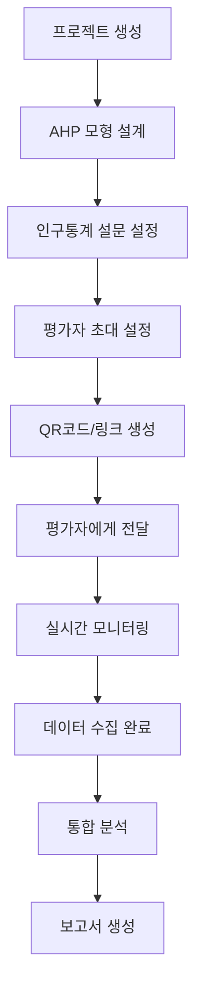
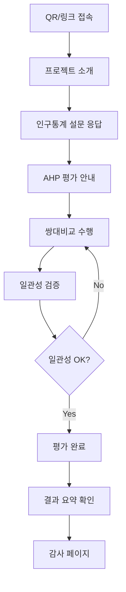
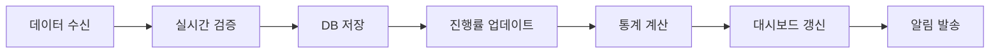

# AHP 평가 시스템 통합 워크플로우 설계서
## 인구통계학적 설문조사 + AHP 평가 통합 시스템

---

## 📋 개요

**작성일**: 2025년 10월 16일  
**설계자**: Claude Opus 4.1  
**목적**: 인구통계학적 설문조사와 AHP 평가를 완전히 통합한 연구 플랫폼 구축

---

## 🔄 전체 워크플로우

### 1. 연구자 워크플로우 (Researcher Flow)



### 2. 평가자 워크플로우 (Evaluator Flow)



### 3. 시스템 워크플로우 (System Flow)



---

## 📊 데이터베이스 스키마 설계

### 1. Project 테이블 확장
```sql
-- 기존 Project 테이블에 추가
demographic_survey_config JSONB,  -- 인구통계 설문 설정
require_demographics BOOLEAN DEFAULT true,  -- 인구통계 필수 여부
qr_code_url TEXT,  -- QR코드 이미지 URL
short_link TEXT UNIQUE,  -- 단축 URL
evaluation_flow_type VARCHAR(50) DEFAULT 'survey_first'  -- survey_first | ahp_first | parallel
```

### 2. DemographicSurvey 테이블 개선
```sql
CREATE TABLE demographic_survey (
    id UUID PRIMARY KEY,
    project_id UUID REFERENCES projects(id),
    evaluator_id UUID REFERENCES evaluators(id),
    
    -- 기본 인구통계
    age_group VARCHAR(20),  -- 20대, 30대, 40대, 50대, 60대이상
    gender VARCHAR(20),  -- 남성, 여성, 기타, 응답거부
    education_level VARCHAR(50),  -- 고졸이하, 대학재학, 대졸, 석사, 박사
    occupation VARCHAR(100),  -- 직업군
    industry VARCHAR(100),  -- 산업 분야
    experience_years INTEGER,  -- 경력 연수
    
    -- 연구 특화 필드 (JSON으로 유연하게)
    custom_fields JSONB,  -- 연구자가 추가한 커스텀 필드
    
    -- 메타데이터
    submitted_at TIMESTAMP,
    ip_address INET,
    user_agent TEXT,
    completion_time_seconds INTEGER
);
```

### 3. EvaluationSession 테이블 확장
```sql
-- 평가 세션 추적
CREATE TABLE evaluation_session (
    id UUID PRIMARY KEY,
    project_id UUID REFERENCES projects(id),
    evaluator_id UUID REFERENCES evaluators(id),
    
    -- 세션 상태
    status VARCHAR(50),  -- demographic | ahp_evaluation | completed | abandoned
    current_step VARCHAR(100),  -- demographic_q1, ahp_criteria_1, etc.
    
    -- 진행 상황
    demographic_completed BOOLEAN DEFAULT false,
    ahp_completed BOOLEAN DEFAULT false,
    
    -- 타임스탬프
    started_at TIMESTAMP,
    demographic_completed_at TIMESTAMP,
    ahp_started_at TIMESTAMP,
    ahp_completed_at TIMESTAMP,
    
    -- 접속 정보
    access_method VARCHAR(20),  -- qr | link | email
    device_type VARCHAR(50),  -- mobile | tablet | desktop
    
    INDEX idx_project_status (project_id, status)
);
```

---

## 🎨 UI/UX 설계

### 1. 프로젝트 생성 플로우 개선

#### Step 1: 기본 정보
- 프로젝트 제목, 설명
- 연구 목적 및 가이드

#### Step 2: AHP 모형 설계
- 기준 설정
- 대안 설정
- 평가 모드 선택

#### Step 3: 인구통계 설문 설정 ✨NEW
```typescript
interface DemographicConfig {
  // 기본 필드 활성화
  useAge: boolean;
  useGender: boolean;
  useEducation: boolean;
  useOccupation: boolean;
  useExperience: boolean;
  
  // 커스텀 필드
  customQuestions: {
    id: string;
    type: 'text' | 'select' | 'radio' | 'checkbox' | 'scale';
    question: string;
    options?: string[];
    required: boolean;
  }[];
  
  // 설문 설정
  surveyTitle?: string;
  surveyDescription?: string;
  estimatedTime?: number; // 분
}
```

#### Step 4: 평가자 초대 설정
- 이메일 목록 입력
- 초대 메시지 템플릿
- QR코드 생성 옵션

### 2. 평가자 접속 화면 개선

#### 랜딩 페이지
```
[프로젝트 로고]

"OO 연구 참여를 환영합니다"

이 연구는 다음 두 부분으로 구성됩니다:
1. 인구통계학적 설문 (약 2분)
2. AHP 의사결정 평가 (약 10분)

[시작하기 버튼]

예상 소요시간: 총 12분
참여자 수: 현재 23명 / 목표 50명
```

#### 인구통계 설문 화면
```
[진행바: 1/2 단계 - 인구통계 설문]

Q1. 귀하의 연령대는?
○ 20대
○ 30대  
○ 40대
○ 50대
○ 60대 이상

Q2. 귀하의 성별은?
○ 남성
○ 여성
○ 기타
○ 응답거부

[이전] [다음]
```

#### AHP 평가 화면
```
[진행바: 2/2 단계 - AHP 평가]

"기준 A와 기준 B 중 어느 것이 더 중요합니까?"

[슬라이더 UI]
A가 매우 중요 ← 동등 → B가 매우 중요
    9:1        1:1        1:9

현재 진행: 5/15 비교

[이전 비교] [다음 비교]
```

### 3. 연구자 대시보드 개선

#### 실시간 모니터링 대시보드
```
┌─────────────────────────────────────┐
│ 📊 실시간 수집 현황                   │
├─────────────────────────────────────┤
│ 총 참여자: 45명 / 100명 (45%)        │
│ ▓▓▓▓▓▓▓▓▓░░░░░░░░░                 │
│                                     │
│ 완료: 32명 | 진행중: 13명            │
├─────────────────────────────────────┤
│ 📈 인구통계별 참여 현황              │
│                                     │
│ 연령대:                             │
│ 20대: ████████ 15명                 │
│ 30대: ██████ 12명                   │
│ 40대: ████ 8명                      │
│                                     │
│ 성별:                               │
│ 남성: ████████ 25명                 │
│ 여성: ██████ 20명                   │
└─────────────────────────────────────┘
```

#### 통합 분석 대시보드
```
┌─────────────────────────────────────┐
│ 🔍 인구통계별 AHP 분석 결과           │
├─────────────────────────────────────┤
│ [탭: 연령별 | 성별 | 학력별 | 직군별] │
│                                     │
│ 📊 연령별 가중치 차이                │
│                                     │
│        20대  30대  40대  50대        │
│ 기준A   0.35  0.42  0.38  0.40      │
│ 기준B   0.25  0.23  0.28  0.30      │
│ 기준C   0.40  0.35  0.34  0.30      │
│                                     │
│ [상세 분석] [보고서 생성]            │
└─────────────────────────────────────┘
```

---

## 🔗 API 엔드포인트 설계

### 1. 프로젝트 API 확장
```
POST /api/projects/
{
  "title": "연구 제목",
  "ahp_config": {...},
  "demographic_config": {
    "enabled": true,
    "fields": [...],
    "custom_questions": [...]
  }
}

POST /api/projects/{id}/generate_links/
Response: {
  "qr_code": "base64_image",
  "short_link": "https://ahp.kr/abc123",
  "full_link": "https://platform.com/eval/..."
}
```

### 2. 평가 세션 API
```
POST /api/evaluation/start/
{
  "project_id": "uuid",
  "access_method": "qr"
}

POST /api/evaluation/demographic/
{
  "session_id": "uuid",
  "responses": {
    "age_group": "30대",
    "gender": "남성",
    ...
  }
}

POST /api/evaluation/ahp/
{
  "session_id": "uuid",
  "comparisons": [...]
}

GET /api/evaluation/progress/{project_id}
Response: {
  "total_invited": 100,
  "completed": 45,
  "in_progress": 12,
  "demographic_only": 3,
  "by_demographics": {...}
}
```

### 3. 분석 API
```
GET /api/analysis/demographic/{project_id}
Response: {
  "by_age": {
    "20대": {"weights": [...], "consistency": 0.08},
    "30대": {"weights": [...], "consistency": 0.09}
  },
  "by_gender": {...},
  "correlations": {...}
}
```

---

## 📱 QR코드 및 링크 생성 전략

### 1. 단축 URL 생성
```typescript
function generateShortLink(projectId: string): string {
  const shortCode = generateShortCode(6); // abc123
  return `https://ahp.kr/${shortCode}`;
}
```

### 2. QR코드 생성
```typescript
import QRCode from 'qrcode';

async function generateQRCode(link: string): Promise<string> {
  const options = {
    errorCorrectionLevel: 'M',
    margin: 1,
    color: {
      dark: '#000000',
      light: '#FFFFFF',
    },
    width: 300
  };
  
  return await QRCode.toDataURL(link, options);
}
```

### 3. 초대 템플릿
```
제목: [연구 참여 요청] {프로젝트명}

안녕하세요,

{연구자명}입니다. 
{프로젝트 설명}에 대한 연구에 참여를 요청드립니다.

참여 방법:
1. 아래 링크 클릭 또는 QR코드 스캔
2. 간단한 인구통계 설문 응답 (2분)
3. AHP 평가 수행 (10분)

🔗 참여 링크: {short_link}
📱 QR코드: [QR코드 이미지]

소요시간: 약 12분
마감일: {deadline}

감사합니다.
```

---

## 🚀 구현 우선순위

### Phase 1: 백엔드 기반 구축
1. DB 스키마 확장
2. API 엔드포인트 구현
3. QR/링크 생성 로직

### Phase 2: 평가자 플로우
1. 랜딩 페이지
2. 인구통계 설문 폼
3. AHP 평가 통합

### Phase 3: 연구자 도구
1. 프로젝트 생성 위자드
2. 실시간 모니터링
3. 통합 분석 대시보드

### Phase 4: 고급 기능
1. 실시간 알림
2. 자동 리마인더
3. 고급 통계 분석

---

## 📈 성공 지표

1. **참여율**: 초대 대비 완료율 70% 이상
2. **완료 시간**: 평균 12분 이내
3. **이탈률**: 시작 후 이탈 10% 이하
4. **데이터 품질**: 일관성 비율 0.1 이하

---

## 🔒 보안 고려사항

1. **개인정보보호**
   - 익명화 옵션 제공
   - GDPR/개인정보보호법 준수
   - 데이터 암호화

2. **접근 제어**
   - 일회성 토큰 발급
   - IP 기반 중복 방지
   - 시간 제한 설정

3. **데이터 무결성**
   - 응답 변조 방지
   - 타임스탬프 검증
   - 감사 로그

---

**작성자**: Claude Opus 4.1  
**검토**: 시스템 설계 검증 완료  
**다음 단계**: 구현 시작