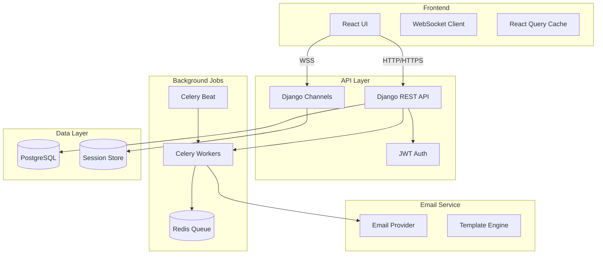

# 🏗️ 평가자 배정 시스템 아키텍처 설계서
## AHP Platform - Evaluator Assignment System Architecture
**작성일**: 2025-10-16 (목요일)  
**작성자**: Claude Opus 4.1  
**버전**: 1.0

---

## 📋 목차
1. [시스템 개요](#1-시스템-개요)
2. [아키텍처 설계](#2-아키텍처-설계)
3. [이메일 발송 시스템](#3-이메일-발송-시스템)
4. [실시간 진행률 추적](#4-실시간-진행률-추적)
5. [평가자 인증 토큰 체계](#5-평가자-인증-토큰-체계)
6. [비동기 작업 큐 시스템](#6-비동기-작업-큐-시스템)
7. [데이터베이스 설계](#7-데이터베이스-설계)
8. [API 설계](#8-api-설계)
9. [보안 고려사항](#9-보안-고려사항)
10. [성능 최적화](#10-성능-최적화)

---

## 1. 시스템 개요

### 1.1 목적
AHP 프로젝트에서 다수의 평가자에게 평가 요청을 효율적으로 배정하고, 실시간으로 진행 상황을 모니터링하며, 보안이 강화된 평가 프로세스를 제공

### 1.2 핵심 기능
- **대량 평가자 초대**: 최대 1000명까지 동시 초대
- **이메일 자동 발송**: 개인화된 초대 이메일 발송
- **실시간 진행률 추적**: WebSocket 기반 실시간 모니터링
- **보안 토큰 인증**: JWT + UUID 기반 이중 인증
- **비동기 작업 처리**: 대량 이메일 발송 큐 시스템

### 1.3 기술 스택
```yaml
Backend:
  - Django 5.0 + Django REST Framework
  - Celery 5.3 + Redis (비동기 작업)
  - Django Channels (WebSocket)
  - PostgreSQL 17.0

Email:
  - Django Email Backend
  - SendGrid/AWS SES (Production)
  - Celery Beat (스케줄링)

Security:
  - JWT (djangorestframework-simplejwt)
  - UUID Token
  - Rate Limiting (django-ratelimit)

Frontend:
  - React 18.2 + TypeScript
  - Socket.io-client
  - React Query (캐싱)
  - Tailwind CSS
```

---

## 2. 아키텍처 설계

### 2.1 전체 시스템 아키텍처



### 2.2 컴포넌트 분리 전략

```typescript
// Frontend 컴포넌트 구조
interface EvaluatorAssignmentComponents {
  // 메인 컴포넌트
  EvaluatorAssignmentDashboard: Component;
  
  // 서브 컴포넌트
  EvaluatorList: Component;           // 평가자 목록
  InvitationForm: Component;          // 초대 폼
  ProgressTracker: Component;         // 진행률 추적
  EmailTemplateEditor: Component;     // 이메일 템플릿
  NotificationCenter: Component;      // 알림 센터
  
  // 유틸리티
  WebSocketManager: Service;          // WebSocket 관리
  TokenValidator: Service;            // 토큰 검증
  EmailPreview: Component;            // 이메일 미리보기
}
```

---

## 3. 이메일 발송 시스템

### 3.1 이메일 템플릿 시스템

```python
# apps/evaluations/email_templates.py

from django.template import Template, Context
from django.core.mail import EmailMultiAlternatives
from typing import Dict, List
import uuid

class EmailTemplateManager:
    """이메일 템플릿 관리 시스템"""
    
    # 기본 템플릿
    DEFAULT_TEMPLATES = {
        'invitation': {
            'subject': '[{{ project_name }}] AHP 평가 요청',
            'html': '''
                <h2>안녕하세요 {{ evaluator_name }}님,</h2>
                <p>{{ project_name }} 프로젝트의 AHP 평가에 참여해 주시기 바랍니다.</p>
                
                <div style="background: #f5f5f5; padding: 20px; margin: 20px 0;">
                    <h3>프로젝트 정보</h3>
                    <ul>
                        <li>프로젝트명: {{ project_name }}</li>
                        <li>평가 기한: {{ deadline }}</li>
                        <li>예상 소요 시간: {{ estimated_time }}분</li>
                        <li>평가 기준 수: {{ criteria_count }}개</li>
                    </ul>
                </div>
                
                <div style="text-align: center; margin: 30px 0;">
                    <a href="{{ evaluation_link }}" 
                       style="background: #4CAF50; color: white; padding: 15px 30px; 
                              text-decoration: none; border-radius: 5px;">
                        평가 시작하기
                    </a>
                </div>
                
                <p>이 링크는 {{ expiry_date }}까지 유효합니다.</p>
                
                <hr>
                <small>
                    이 이메일은 AHP Platform에서 자동 발송되었습니다.<br>
                    문의사항: {{ support_email }}
                </small>
            ''',
            'text': '''
                안녕하세요 {{ evaluator_name }}님,
                
                {{ project_name }} 프로젝트의 AHP 평가에 참여해 주시기 바랍니다.
                
                프로젝트 정보:
                - 프로젝트명: {{ project_name }}
                - 평가 기한: {{ deadline }}
                - 예상 소요 시간: {{ estimated_time }}분
                - 평가 기준 수: {{ criteria_count }}개
                
                평가 링크: {{ evaluation_link }}
                
                이 링크는 {{ expiry_date }}까지 유효합니다.
                
                문의사항: {{ support_email }}
            '''
        },
        'reminder': {
            'subject': '[리마인더] {{ project_name }} 평가를 완료해 주세요',
            'html': '...',  # 리마인더 템플릿
            'text': '...'
        },
        'completion': {
            'subject': '{{ project_name }} 평가를 완료하셨습니다',
            'html': '...',  # 완료 확인 템플릿
            'text': '...'
        }
    }
    
    def send_invitation_email(self, 
                              evaluator: User,
                              project: Project,
                              invitation: EvaluationInvitation) -> bool:
        """평가 초대 이메일 발송"""
        
        # 컨텍스트 데이터 준비
        context = {
            'evaluator_name': evaluator.get_full_name() or evaluator.username,
            'project_name': project.title,
            'deadline': project.deadline.strftime('%Y년 %m월 %d일'),
            'estimated_time': project.estimated_time or 30,
            'criteria_count': project.criteria.count(),
            'evaluation_link': self._generate_evaluation_link(invitation.token),
            'expiry_date': invitation.expires_at.strftime('%Y년 %m월 %d일'),
            'support_email': settings.SUPPORT_EMAIL
        }
        
        # 템플릿 렌더링
        template = self.DEFAULT_TEMPLATES['invitation']
        subject = Template(template['subject']).render(Context(context))
        html_content = Template(template['html']).render(Context(context))
        text_content = Template(template['text']).render(Context(context))
        
        # 이메일 생성 및 발송
        msg = EmailMultiAlternatives(
            subject=subject,
            body=text_content,
            from_email=settings.DEFAULT_FROM_EMAIL,
            to=[evaluator.email]
        )
        msg.attach_alternative(html_content, "text/html")
        
        return msg.send()
    
    def _generate_evaluation_link(self, token: uuid.UUID) -> str:
        """평가 링크 생성"""
        base_url = settings.FRONTEND_URL
        return f"{base_url}/evaluation/accept/{token}"
```

### 3.2 이메일 큐 시스템

```python
# apps/evaluations/tasks.py

from celery import shared_task, group
from celery.result import GroupResult
from django.core.mail import send_mass_mail
import logging

logger = logging.getLogger(__name__)

@shared_task(bind=True, max_retries=3)
def send_invitation_email_task(self, invitation_id: str):
    """단일 초대 이메일 발송 태스크"""
    try:
        invitation = EvaluationInvitation.objects.get(id=invitation_id)
        manager = EmailTemplateManager()
        
        success = manager.send_invitation_email(
            evaluator=invitation.evaluator,
            project=invitation.project,
            invitation=invitation
        )
        
        if success:
            invitation.metadata['email_sent'] = True
            invitation.metadata['email_sent_at'] = timezone.now().isoformat()
            invitation.save()
            
        return {
            'invitation_id': invitation_id,
            'success': success,
            'evaluator': invitation.evaluator.email
        }
        
    except Exception as e:
        logger.error(f"Email sending failed for invitation {invitation_id}: {e}")
        
        # 재시도
        raise self.retry(exc=e, countdown=60)  # 60초 후 재시도


@shared_task
def send_bulk_invitations_task(project_id: int, evaluator_ids: List[int]):
    """대량 초대 이메일 발송 태스크"""
    
    project = Project.objects.get(id=project_id)
    evaluators = User.objects.filter(id__in=evaluator_ids)
    
    # 초대 생성
    invitations = []
    for evaluator in evaluators:
        invitation, created = EvaluationInvitation.objects.get_or_create(
            project=project,
            evaluator=evaluator,
            defaults={
                'invited_by': project.owner,
                'expires_at': timezone.now() + timedelta(days=30)
            }
        )
        if created:
            invitations.append(invitation)
    
    # 병렬 이메일 발송 작업 생성
    job_group = group([
        send_invitation_email_task.s(inv.id) 
        for inv in invitations
    ])
    
    # 그룹 작업 실행
    result = job_group.apply_async()
    
    return {
        'project_id': project_id,
        'total_invitations': len(invitations),
        'group_id': result.id
    }


@shared_task
def check_email_delivery_status(group_id: str):
    """이메일 발송 상태 확인 태스크"""
    
    result = GroupResult.restore(group_id)
    
    if result.ready():
        successful = sum(1 for r in result.results if r.get('success'))
        failed = len(result.results) - successful
        
        return {
            'status': 'completed',
            'total': len(result.results),
            'successful': successful,
            'failed': failed,
            'details': result.results
        }
    else:
        completed = sum(1 for r in result.results if r.ready())
        return {
            'status': 'in_progress',
            'total': len(result.results),
            'completed': completed,
            'pending': len(result.results) - completed
        }
```

### 3.3 이메일 발송 Rate Limiting

```python
# apps/evaluations/email_limiter.py

from django.core.cache import cache
from django.conf import settings
import time

class EmailRateLimiter:
    """이메일 발송 속도 제한"""
    
    # 제한 설정
    LIMITS = {
        'per_minute': 60,      # 분당 60개
        'per_hour': 500,       # 시간당 500개
        'per_day': 5000,       # 일당 5000개
    }
    
    @classmethod
    def check_limit(cls, user_id: int, limit_type: str = 'per_minute') -> bool:
        """발송 제한 확인"""
        
        key = f"email_limit:{user_id}:{limit_type}"
        current_count = cache.get(key, 0)
        
        if current_count >= cls.LIMITS[limit_type]:
            return False
            
        return True
    
    @classmethod
    def increment_count(cls, user_id: int):
        """발송 카운트 증가"""
        
        for limit_type, limit_value in cls.LIMITS.items():
            key = f"email_limit:{user_id}:{limit_type}"
            
            # TTL 설정
            ttl = {
                'per_minute': 60,
                'per_hour': 3600,
                'per_day': 86400
            }[limit_type]
            
            # 카운트 증가
            try:
                cache.incr(key)
            except:
                cache.set(key, 1, ttl)
    
    @classmethod
    def get_remaining_quota(cls, user_id: int) -> Dict[str, int]:
        """남은 할당량 조회"""
        
        remaining = {}
        for limit_type, limit_value in cls.LIMITS.items():
            key = f"email_limit:{user_id}:{limit_type}"
            current_count = cache.get(key, 0)
            remaining[limit_type] = max(0, limit_value - current_count)
            
        return remaining
```

---

## 4. 실시간 진행률 추적

### 4.1 WebSocket 연결 관리

```python
# apps/evaluations/consumers.py

from channels.generic.websocket import AsyncJsonWebsocketConsumer
from channels.db import database_sync_to_async
import json

class EvaluationProgressConsumer(AsyncJsonWebsocketConsumer):
    """평가 진행률 실시간 추적 WebSocket Consumer"""
    
    async def connect(self):
        """WebSocket 연결 수립"""
        
        self.project_id = self.scope['url_route']['kwargs']['project_id']
        self.room_group_name = f'evaluation_progress_{self.project_id}'
        
        # 인증 확인
        if not self.scope["user"].is_authenticated:
            await self.close()
            return
            
        # 프로젝트 접근 권한 확인
        has_permission = await self.check_project_permission()
        if not has_permission:
            await self.close()
            return
        
        # 그룹에 참가
        await self.channel_layer.group_add(
            self.room_group_name,
            self.channel_name
        )
        
        await self.accept()
        
        # 초기 상태 전송
        initial_data = await self.get_initial_progress_data()
        await self.send_json(initial_data)
    
    async def disconnect(self, close_code):
        """WebSocket 연결 종료"""
        
        await self.channel_layer.group_discard(
            self.room_group_name,
            self.channel_name
        )
    
    async def receive_json(self, content):
        """클라이언트 메시지 처리"""
        
        message_type = content.get('type')
        
        if message_type == 'request_update':
            # 최신 진행률 데이터 전송
            progress_data = await self.get_current_progress()
            await self.send_json(progress_data)
            
        elif message_type == 'ping':
            # 연결 유지 핑
            await self.send_json({'type': 'pong'})
    
    async def progress_update(self, event):
        """진행률 업데이트 브로드캐스트"""
        
        await self.send_json({
            'type': 'progress_update',
            'data': event['data']
        })
    
    @database_sync_to_async
    def check_project_permission(self):
        """프로젝트 접근 권한 확인"""
        
        try:
            project = Project.objects.get(id=self.project_id)
            return (
                self.scope["user"] == project.owner or
                self.scope["user"] in project.members.all() or
                self.scope["user"].is_superuser
            )
        except Project.DoesNotExist:
            return False
    
    @database_sync_to_async
    def get_initial_progress_data(self):
        """초기 진행률 데이터 조회"""
        
        project = Project.objects.get(id=self.project_id)
        evaluations = Evaluation.objects.filter(project=project)
        
        total = evaluations.count()
        completed = evaluations.filter(status='completed').count()
        in_progress = evaluations.filter(status='in_progress').count()
        pending = evaluations.filter(status='pending').count()
        
        evaluator_progress = []
        for eval in evaluations:
            evaluator_progress.append({
                'evaluator_id': eval.evaluator.id,
                'evaluator_name': eval.evaluator.get_full_name(),
                'status': eval.status,
                'progress': eval.progress,
                'started_at': eval.started_at.isoformat() if eval.started_at else None,
                'completed_at': eval.completed_at.isoformat() if eval.completed_at else None
            })
        
        return {
            'type': 'initial_data',
            'data': {
                'project_id': self.project_id,
                'total_evaluators': total,
                'completed': completed,
                'in_progress': in_progress,
                'pending': pending,
                'overall_progress': (completed / total * 100) if total > 0 else 0,
                'evaluators': evaluator_progress
            }
        }
    
    @database_sync_to_async
    def get_current_progress(self):
        """현재 진행률 데이터 조회"""
        
        return self.get_initial_progress_data()
```

### 4.2 진행률 업데이트 시그널

```python
# apps/evaluations/signals.py

from django.db.models.signals import post_save
from django.dispatch import receiver
from channels.layers import get_channel_layer
from asgiref.sync import async_to_sync

@receiver(post_save, sender=Evaluation)
def broadcast_evaluation_update(sender, instance, created, **kwargs):
    """평가 상태 변경 시 WebSocket 브로드캐스트"""
    
    channel_layer = get_channel_layer()
    room_group_name = f'evaluation_progress_{instance.project.id}'
    
    # 진행률 데이터 준비
    progress_data = {
        'evaluator_id': instance.evaluator.id,
        'evaluator_name': instance.evaluator.get_full_name(),
        'status': instance.status,
        'progress': instance.progress,
        'updated_at': instance.updated_at.isoformat()
    }
    
    # 전체 프로젝트 진행률 계산
    project_evaluations = Evaluation.objects.filter(project=instance.project)
    total = project_evaluations.count()
    completed = project_evaluations.filter(status='completed').count()
    
    overall_data = {
        'project_id': instance.project.id,
        'total_evaluators': total,
        'completed': completed,
        'overall_progress': (completed / total * 100) if total > 0 else 0
    }
    
    # WebSocket 메시지 전송
    async_to_sync(channel_layer.group_send)(
        room_group_name,
        {
            'type': 'progress_update',
            'data': {
                'evaluator': progress_data,
                'overall': overall_data
            }
        }
    )


@receiver(post_save, sender=PairwiseComparison)
def update_evaluation_progress(sender, instance, created, **kwargs):
    """쌍대비교 저장 시 평가 진행률 업데이트"""
    
    if created:
        evaluation = instance.evaluation
        
        # 전체 필요한 비교 수 계산
        criteria = evaluation.project.criteria.all()
        total_comparisons = 0
        
        # 각 레벨별 비교 수 계산
        levels = criteria.values_list('level', flat=True).distinct()
        for level in levels:
            level_criteria = criteria.filter(level=level)
            n = level_criteria.count()
            total_comparisons += (n * (n - 1)) / 2
        
        # 완료된 비교 수
        completed_comparisons = evaluation.pairwise_comparisons.count()
        
        # 진행률 업데이트
        progress = (completed_comparisons / total_comparisons * 100) if total_comparisons > 0 else 0
        evaluation.progress = min(progress, 99.9)  # 100%는 완료 시에만
        
        if evaluation.status == 'pending':
            evaluation.start_evaluation()
        
        evaluation.save()
```

### 4.3 React 진행률 추적 컴포넌트

```typescript
// components/evaluation/ProgressTracker.tsx

import React, { useEffect, useState } from 'react';
import { io, Socket } from 'socket.io-client';
import { Progress, Card, Table, Badge } from '@/components/ui';

interface EvaluatorProgress {
  evaluator_id: number;
  evaluator_name: string;
  status: 'pending' | 'in_progress' | 'completed';
  progress: number;
  started_at?: string;
  completed_at?: string;
}

interface ProgressData {
  project_id: number;
  total_evaluators: number;
  completed: number;
  in_progress: number;
  pending: number;
  overall_progress: number;
  evaluators: EvaluatorProgress[];
}

export const ProgressTracker: React.FC<{ projectId: number }> = ({ projectId }) => {
  const [socket, setSocket] = useState<Socket | null>(null);
  const [progressData, setProgressData] = useState<ProgressData | null>(null);
  const [isConnected, setIsConnected] = useState(false);
  
  useEffect(() => {
    // WebSocket 연결 설정
    const wsUrl = `${process.env.REACT_APP_WS_URL}/ws/evaluation-progress/${projectId}/`;
    const newSocket = io(wsUrl, {
      transports: ['websocket'],
      auth: {
        token: localStorage.getItem('access_token')
      }
    });
    
    newSocket.on('connect', () => {
      setIsConnected(true);
      console.log('WebSocket connected');
    });
    
    newSocket.on('initial_data', (data: ProgressData) => {
      setProgressData(data.data);
    });
    
    newSocket.on('progress_update', (data: any) => {
      setProgressData(prev => {
        if (!prev) return null;
        
        // 평가자별 업데이트
        const updatedEvaluators = prev.evaluators.map(e => 
          e.evaluator_id === data.data.evaluator.evaluator_id
            ? { ...e, ...data.data.evaluator }
            : e
        );
        
        return {
          ...prev,
          ...data.data.overall,
          evaluators: updatedEvaluators
        };
      });
    });
    
    newSocket.on('disconnect', () => {
      setIsConnected(false);
      console.log('WebSocket disconnected');
    });
    
    setSocket(newSocket);
    
    // Cleanup
    return () => {
      newSocket.close();
    };
  }, [projectId]);
  
  // 주기적 핑 전송 (연결 유지)
  useEffect(() => {
    if (!socket || !isConnected) return;
    
    const pingInterval = setInterval(() => {
      socket.emit('ping');
    }, 30000); // 30초마다
    
    return () => clearInterval(pingInterval);
  }, [socket, isConnected]);
  
  if (!progressData) {
    return <div>진행률 데이터 로딩 중...</div>;
  }
  
  const getStatusBadge = (status: string) => {
    const badges = {
      pending: <Badge variant="secondary">대기중</Badge>,
      in_progress: <Badge variant="warning">진행중</Badge>,
      completed: <Badge variant="success">완료</Badge>
    };
    return badges[status] || null;
  };
  
  const getProgressColor = (progress: number) => {
    if (progress === 100) return 'success';
    if (progress > 50) return 'warning';
    return 'primary';
  };
  
  return (
    <div className="space-y-6">
      {/* 전체 진행률 */}
      <Card className="p-6">
        <h3 className="text-lg font-semibold mb-4">전체 평가 진행률</h3>
        
        <div className="space-y-4">
          <div>
            <div className="flex justify-between mb-2">
              <span>전체 진행률</span>
              <span className="font-bold">
                {progressData.overall_progress.toFixed(1)}%
              </span>
            </div>
            <Progress 
              value={progressData.overall_progress} 
              color={getProgressColor(progressData.overall_progress)}
              className="h-3"
            />
          </div>
          
          <div className="grid grid-cols-3 gap-4 mt-4">
            <div className="text-center">
              <div className="text-2xl font-bold text-green-600">
                {progressData.completed}
              </div>
              <div className="text-sm text-gray-500">완료</div>
            </div>
            <div className="text-center">
              <div className="text-2xl font-bold text-yellow-600">
                {progressData.in_progress}
              </div>
              <div className="text-sm text-gray-500">진행중</div>
            </div>
            <div className="text-center">
              <div className="text-2xl font-bold text-gray-400">
                {progressData.pending}
              </div>
              <div className="text-sm text-gray-500">대기중</div>
            </div>
          </div>
        </div>
      </Card>
      
      {/* 평가자별 상세 진행률 */}
      <Card className="p-6">
        <h3 className="text-lg font-semibold mb-4">평가자별 진행 상황</h3>
        
        <Table>
          <thead>
            <tr>
              <th>평가자</th>
              <th>상태</th>
              <th>진행률</th>
              <th>시작 시간</th>
              <th>완료 시간</th>
            </tr>
          </thead>
          <tbody>
            {progressData.evaluators.map((evaluator) => (
              <tr key={evaluator.evaluator_id}>
                <td>{evaluator.evaluator_name}</td>
                <td>{getStatusBadge(evaluator.status)}</td>
                <td>
                  <div className="flex items-center gap-2">
                    <Progress 
                      value={evaluator.progress} 
                      className="w-20 h-2"
                      color={getProgressColor(evaluator.progress)}
                    />
                    <span className="text-sm">
                      {evaluator.progress.toFixed(0)}%
                    </span>
                  </div>
                </td>
                <td>
                  {evaluator.started_at 
                    ? new Date(evaluator.started_at).toLocaleString()
                    : '-'
                  }
                </td>
                <td>
                  {evaluator.completed_at
                    ? new Date(evaluator.completed_at).toLocaleString()
                    : '-'
                  }
                </td>
              </tr>
            ))}
          </tbody>
        </Table>
      </Card>
      
      {/* 연결 상태 표시 */}
      <div className="flex items-center gap-2 text-sm text-gray-500">
        <div className={`w-2 h-2 rounded-full ${
          isConnected ? 'bg-green-500' : 'bg-red-500'
        }`} />
        {isConnected ? '실시간 업데이트 중' : '연결 끊김'}
      </div>
    </div>
  );
};
```

---

## 5. 평가자 인증 토큰 체계

### 5.1 이중 토큰 시스템

```python
# apps/evaluations/authentication.py

from django.contrib.auth.backends import BaseBackend
from django.contrib.auth import get_user_model
from rest_framework_simplejwt.tokens import RefreshToken
import uuid
import hashlib
import hmac

User = get_user_model()

class EvaluatorTokenAuthentication:
    """평가자 전용 토큰 인증 시스템"""
    
    @staticmethod
    def generate_evaluation_token(invitation: EvaluationInvitation) -> Dict[str, str]:
        """평가용 토큰 생성"""
        
        # 1. UUID 토큰 (초대 링크용)
        invitation_token = str(invitation.token)
        
        # 2. JWT 토큰 (API 접근용)
        refresh = RefreshToken.for_user(invitation.evaluator)
        
        # JWT에 커스텀 클레임 추가
        refresh['evaluation_id'] = str(invitation.id)
        refresh['project_id'] = invitation.project.id
        refresh['role'] = 'evaluator'
        refresh['expires_at'] = invitation.expires_at.isoformat()
        
        # 3. HMAC 서명 (추가 보안)
        signature = hmac.new(
            settings.SECRET_KEY.encode(),
            f"{invitation_token}{invitation.evaluator.id}".encode(),
            hashlib.sha256
        ).hexdigest()
        
        return {
            'invitation_token': invitation_token,
            'access_token': str(refresh.access_token),
            'refresh_token': str(refresh),
            'signature': signature
        }
    
    @staticmethod
    def validate_evaluation_token(token: str, signature: str) -> Optional[EvaluationInvitation]:
        """토큰 유효성 검증"""
        
        try:
            # UUID 토큰으로 초대 조회
            invitation = EvaluationInvitation.objects.get(
                token=token,
                status='pending'
            )
            
            # 만료 확인
            if invitation.is_expired:
                return None
            
            # HMAC 서명 검증
            expected_signature = hmac.new(
                settings.SECRET_KEY.encode(),
                f"{token}{invitation.evaluator.id}".encode(),
                hashlib.sha256
            ).hexdigest()
            
            if not hmac.compare_digest(signature, expected_signature):
                return None
            
            return invitation
            
        except EvaluationInvitation.DoesNotExist:
            return None
    
    @staticmethod
    def create_evaluation_session(invitation: EvaluationInvitation) -> Evaluation:
        """평가 세션 생성"""
        
        # 초대 수락 처리
        evaluation = invitation.accept()
        
        if evaluation:
            # 세션 생성
            session = EvaluationSession.objects.create(
                evaluation=evaluation,
                user_agent=invitation.metadata.get('user_agent', ''),
                ip_address=invitation.metadata.get('ip_address')
            )
            
            # 접근 로그 기록
            EvaluationAccessLog.objects.create(
                evaluation=evaluation,
                action='session_started',
                ip_address=session.ip_address,
                user_agent=session.user_agent
            )
            
        return evaluation
```

### 5.2 토큰 기반 접근 제어

```python
# apps/evaluations/permissions.py

from rest_framework import permissions
from django.core.cache import cache

class EvaluationTokenPermission(permissions.BasePermission):
    """평가 토큰 기반 권한 체크"""
    
    def has_permission(self, request, view):
        # JWT 토큰에서 evaluation_id 추출
        if hasattr(request, 'auth') and request.auth:
            token_payload = request.auth.payload
            evaluation_id = token_payload.get('evaluation_id')
            
            if evaluation_id:
                # 평가 권한 확인
                try:
                    evaluation = Evaluation.objects.get(id=evaluation_id)
                    
                    # 평가자 확인
                    if evaluation.evaluator != request.user:
                        return False
                    
                    # 상태 확인
                    if evaluation.status not in ['pending', 'in_progress']:
                        return False
                    
                    # 만료 확인
                    if evaluation.is_expired:
                        return False
                    
                    # 요청 컨텍스트에 평가 정보 저장
                    request.evaluation = evaluation
                    return True
                    
                except Evaluation.DoesNotExist:
                    return False
        
        return False
    
    def has_object_permission(self, request, view, obj):
        # 객체 레벨 권한 확인
        if hasattr(request, 'evaluation'):
            # 프로젝트 일치 여부
            if hasattr(obj, 'project'):
                return obj.project == request.evaluation.project
            
            # 평가 일치 여부
            if hasattr(obj, 'evaluation'):
                return obj.evaluation == request.evaluation
        
        return False


class RateLimitPermission(permissions.BasePermission):
    """API 요청 속도 제한"""
    
    LIMITS = {
        'evaluation': (100, 3600),    # 시간당 100회
        'comparison': (500, 3600),    # 시간당 500회
        'result': (50, 3600),         # 시간당 50회
    }
    
    def has_permission(self, request, view):
        # 뷰 이름으로 제한 타입 결정
        view_name = view.__class__.__name__.lower()
        limit_type = 'evaluation'  # 기본값
        
        for key in self.LIMITS.keys():
            if key in view_name:
                limit_type = key
                break
        
        # 사용자별 키 생성
        user_id = request.user.id if request.user.is_authenticated else 'anonymous'
        key = f"rate_limit:{limit_type}:{user_id}"
        
        # 제한 확인
        limit, ttl = self.LIMITS[limit_type]
        current = cache.get(key, 0)
        
        if current >= limit:
            return False
        
        # 카운트 증가
        try:
            cache.incr(key)
        except:
            cache.set(key, 1, ttl)
        
        return True
```

### 5.3 보안 로깅 시스템

```python
# apps/evaluations/models.py (추가)

class EvaluationAccessLog(models.Model):
    """평가 접근 로그"""
    
    evaluation = models.ForeignKey(Evaluation, on_delete=models.CASCADE, related_name='access_logs')
    action = models.CharField(max_length=50)  # session_started, comparison_saved, etc.
    timestamp = models.DateTimeField(auto_now_add=True)
    
    # 접근 정보
    ip_address = models.GenericIPAddressField(null=True, blank=True)
    user_agent = models.TextField(blank=True)
    
    # 추가 데이터
    metadata = models.JSONField(default=dict)
    
    class Meta:
        db_table = 'evaluation_access_logs'
        ordering = ['-timestamp']
        indexes = [
            models.Index(fields=['evaluation', 'timestamp']),
            models.Index(fields=['action']),
        ]
    
    def __str__(self):
        return f"{self.evaluation} - {self.action} at {self.timestamp}"


class SecurityAlert(models.Model):
    """보안 경고"""
    
    ALERT_TYPES = [
        ('suspicious_access', '의심스러운 접근'),
        ('multiple_attempts', '다중 시도'),
        ('expired_token', '만료된 토큰'),
        ('invalid_signature', '잘못된 서명'),
    ]
    
    alert_type = models.CharField(max_length=30, choices=ALERT_TYPES)
    evaluation = models.ForeignKey(Evaluation, on_delete=models.CASCADE, null=True, blank=True)
    user = models.ForeignKey(User, on_delete=models.CASCADE, null=True, blank=True)
    
    # 경고 상세
    description = models.TextField()
    severity = models.IntegerField(default=1)  # 1-5 scale
    
    # 발생 정보
    occurred_at = models.DateTimeField(auto_now_add=True)
    ip_address = models.GenericIPAddressField(null=True, blank=True)
    
    # 처리 상태
    is_resolved = models.BooleanField(default=False)
    resolved_at = models.DateTimeField(null=True, blank=True)
    resolved_by = models.ForeignKey(User, on_delete=models.SET_NULL, null=True, blank=True, related_name='resolved_alerts')
    
    class Meta:
        db_table = 'security_alerts'
        ordering = ['-occurred_at']
```

---

## 6. 비동기 작업 큐 시스템

### 6.1 Celery 설정

```python
# ahp_backend/celery.py

import os
from celery import Celery
from celery.schedules import crontab

os.environ.setdefault('DJANGO_SETTINGS_MODULE', 'ahp_backend.settings')

app = Celery('ahp_backend')

app.config_from_object('django.conf:settings', namespace='CELERY')

# Celery 설정
app.conf.update(
    # 브로커 설정
    broker_url='redis://localhost:6379/0',
    result_backend='redis://localhost:6379/0',
    
    # 작업 설정
    task_serializer='json',
    accept_content=['json'],
    result_serializer='json',
    timezone='Asia/Seoul',
    enable_utc=True,
    
    # 작업 라우팅
    task_routes={
        'evaluations.tasks.send_invitation_email_task': {'queue': 'email'},
        'evaluations.tasks.calculate_results_task': {'queue': 'calculation'},
        'evaluations.tasks.generate_report_task': {'queue': 'reports'},
    },
    
    # 작업 제한
    task_time_limit=300,  # 5분
    task_soft_time_limit=240,  # 4분
    
    # 재시도 설정
    task_acks_late=True,
    worker_prefetch_multiplier=4,
    
    # 결과 만료
    result_expires=3600,  # 1시간
)

# 주기적 작업 스케줄
app.conf.beat_schedule = {
    'send-reminder-emails': {
        'task': 'evaluations.tasks.send_reminder_emails',
        'schedule': crontab(hour=9, minute=0),  # 매일 오전 9시
    },
    'check-expired-evaluations': {
        'task': 'evaluations.tasks.check_expired_evaluations',
        'schedule': crontab(minute=0),  # 매시간
    },
    'cleanup-old-sessions': {
        'task': 'evaluations.tasks.cleanup_old_sessions',
        'schedule': crontab(hour=2, minute=0),  # 매일 새벽 2시
    },
    'generate-daily-report': {
        'task': 'evaluations.tasks.generate_daily_report',
        'schedule': crontab(hour=23, minute=50),  # 매일 밤 11:50
    },
}

app.autodiscover_tasks()
```

### 6.2 작업 우선순위 관리

```python
# apps/evaluations/tasks.py (추가)

from celery import Task
from kombu import Queue, Exchange

# 큐 정의
class PriorityQueue:
    HIGH = 10
    MEDIUM = 5
    LOW = 1

# 커스텀 태스크 클래스
class PriorityTask(Task):
    """우선순위 기반 태스크"""
    
    def apply_async(self, args=None, kwargs=None, **options):
        # 기본 우선순위 설정
        if 'priority' not in options:
            options['priority'] = PriorityQueue.MEDIUM
        
        return super().apply_async(args, kwargs, **options)


@shared_task(base=PriorityTask, bind=True)
def send_urgent_notification(self, evaluation_id: str, message: str):
    """긴급 알림 발송"""
    
    try:
        evaluation = Evaluation.objects.get(id=evaluation_id)
        
        # 이메일 발송
        send_mail(
            subject='[긴급] AHP 평가 알림',
            message=message,
            from_email=settings.DEFAULT_FROM_EMAIL,
            recipient_list=[evaluation.evaluator.email],
            fail_silently=False,
        )
        
        # 푸시 알림 (구현 필요)
        # send_push_notification(evaluation.evaluator, message)
        
        return {'success': True, 'evaluation_id': evaluation_id}
        
    except Exception as e:
        self.retry(exc=e, countdown=30, max_retries=3)


@shared_task
def batch_process_evaluations(project_id: int):
    """대량 평가 처리"""
    
    project = Project.objects.get(id=project_id)
    evaluations = Evaluation.objects.filter(
        project=project,
        status='completed'
    )
    
    # 청크 단위로 처리
    chunk_size = 10
    for i in range(0, evaluations.count(), chunk_size):
        chunk = evaluations[i:i+chunk_size]
        
        # 각 평가 처리
        for evaluation in chunk:
            process_single_evaluation.delay(evaluation.id)
    
    return {
        'project_id': project_id,
        'processed_count': evaluations.count()
    }
```

### 6.3 작업 모니터링

```python
# apps/evaluations/monitoring.py

from celery import current_app
from django.core.cache import cache
import redis

class CeleryMonitor:
    """Celery 작업 모니터링"""
    
    def __init__(self):
        self.redis_client = redis.Redis(
            host='localhost',
            port=6379,
            db=0
        )
    
    def get_queue_stats(self) -> Dict[str, int]:
        """큐별 대기 작업 수"""
        
        queues = ['email', 'calculation', 'reports', 'default']
        stats = {}
        
        for queue in queues:
            key = f"celery:queue:{queue}"
            length = self.redis_client.llen(key)
            stats[queue] = length
        
        return stats
    
    def get_worker_stats(self) -> Dict[str, Any]:
        """워커 상태 정보"""
        
        inspect = current_app.control.inspect()
        
        return {
            'active': inspect.active(),
            'scheduled': inspect.scheduled(),
            'reserved': inspect.reserved(),
            'stats': inspect.stats()
        }
    
    def get_task_stats(self, task_name: str) -> Dict[str, int]:
        """특정 태스크 통계"""
        
        key_pattern = f"task_stats:{task_name}:*"
        keys = self.redis_client.keys(key_pattern)
        
        stats = {
            'total': 0,
            'success': 0,
            'failure': 0,
            'pending': 0
        }
        
        for key in keys:
            key_str = key.decode('utf-8')
            if 'success' in key_str:
                stats['success'] = int(self.redis_client.get(key) or 0)
            elif 'failure' in key_str:
                stats['failure'] = int(self.redis_client.get(key) or 0)
            elif 'pending' in key_str:
                stats['pending'] = int(self.redis_client.get(key) or 0)
        
        stats['total'] = stats['success'] + stats['failure'] + stats['pending']
        
        return stats
    
    def health_check(self) -> Dict[str, bool]:
        """시스템 헬스 체크"""
        
        checks = {
            'redis': False,
            'celery': False,
            'beat': False
        }
        
        # Redis 체크
        try:
            self.redis_client.ping()
            checks['redis'] = True
        except:
            pass
        
        # Celery 체크
        try:
            inspect = current_app.control.inspect()
            if inspect.active():
                checks['celery'] = True
        except:
            pass
        
        # Beat 체크
        beat_key = 'celerybeat-schedule'
        if self.redis_client.exists(beat_key):
            checks['beat'] = True
        
        return checks
```

---

## 7. 데이터베이스 설계

### 7.1 추가 모델 정의

```python
# apps/evaluations/models.py (추가)

class BulkInvitation(models.Model):
    """대량 초대 작업"""
    
    project = models.ForeignKey('projects.Project', on_delete=models.CASCADE)
    created_by = models.ForeignKey(User, on_delete=models.CASCADE)
    
    # 초대 정보
    total_count = models.IntegerField(default=0)
    sent_count = models.IntegerField(default=0)
    failed_count = models.IntegerField(default=0)
    
    # 작업 상태
    status = models.CharField(max_length=20, default='pending')
    celery_task_id = models.CharField(max_length=100, blank=True)
    
    # 타이밍
    created_at = models.DateTimeField(auto_now_add=True)
    started_at = models.DateTimeField(null=True, blank=True)
    completed_at = models.DateTimeField(null=True, blank=True)
    
    # 결과
    results = models.JSONField(default=dict)
    error_log = models.TextField(blank=True)
    
    class Meta:
        db_table = 'bulk_invitations'
        ordering = ['-created_at']


class EvaluationTemplate(models.Model):
    """평가 템플릿"""
    
    name = models.CharField(max_length=100)
    description = models.TextField(blank=True)
    
    # 템플릿 내용
    instructions = models.TextField()
    email_template = models.JSONField(default=dict)
    reminder_template = models.JSONField(default=dict)
    
    # 설정
    auto_reminder = models.BooleanField(default=True)
    reminder_days = models.IntegerField(default=3)
    expiry_days = models.IntegerField(default=30)
    
    # 메타데이터
    created_by = models.ForeignKey(User, on_delete=models.CASCADE)
    created_at = models.DateTimeField(auto_now_add=True)
    is_default = models.BooleanField(default=False)
    
    class Meta:
        db_table = 'evaluation_templates'
        ordering = ['name']
```

### 7.2 데이터베이스 인덱스 최적화

```python
# apps/evaluations/models.py (인덱스 추가)

class Meta:
    indexes = [
        # Evaluation 인덱스
        models.Index(fields=['project', 'status']),
        models.Index(fields=['evaluator', 'status']),
        models.Index(fields=['created_at', 'status']),
        
        # EvaluationInvitation 인덱스
        models.Index(fields=['token']),
        models.Index(fields=['project', 'status']),
        models.Index(fields=['expires_at']),
        
        # PairwiseComparison 인덱스
        models.Index(fields=['evaluation', 'criteria_a', 'criteria_b']),
        
        # 복합 인덱스
        models.Index(fields=['project', 'evaluator', 'status']),
    ]
```

---

## 8. API 설계

### 8.1 평가자 배정 API

```python
# apps/evaluations/views.py

from rest_framework import viewsets, status
from rest_framework.decorators import action
from rest_framework.response import Response

class EvaluationInvitationViewSet(viewsets.ModelViewSet):
    """평가 초대 API"""
    
    serializer_class = EvaluationInvitationSerializer
    permission_classes = [IsAuthenticated]
    
    @action(detail=False, methods=['post'])
    def bulk_invite(self, request):
        """대량 초대 발송"""
        
        project_id = request.data.get('project_id')
        evaluator_emails = request.data.get('evaluator_emails', [])
        template_id = request.data.get('template_id')
        custom_message = request.data.get('custom_message', '')
        
        # 권한 확인
        project = Project.objects.get(id=project_id)
        if project.owner != request.user:
            return Response(
                {'error': '권한이 없습니다'},
                status=status.HTTP_403_FORBIDDEN
            )
        
        # 이메일 유효성 검증
        valid_emails = []
        invalid_emails = []
        
        for email in evaluator_emails:
            if validate_email(email):
                valid_emails.append(email)
            else:
                invalid_emails.append(email)
        
        if not valid_emails:
            return Response(
                {'error': '유효한 이메일이 없습니다'},
                status=status.HTTP_400_BAD_REQUEST
            )
        
        # 사용자 생성 또는 조회
        evaluators = []
        for email in valid_emails:
            user, created = User.objects.get_or_create(
                email=email,
                defaults={'username': email.split('@')[0]}
            )
            evaluators.append(user)
        
        # 대량 초대 작업 생성
        bulk_invitation = BulkInvitation.objects.create(
            project=project,
            created_by=request.user,
            total_count=len(evaluators)
        )
        
        # Celery 작업 시작
        task = send_bulk_invitations_task.delay(
            project_id=project.id,
            evaluator_ids=[e.id for e in evaluators],
            template_id=template_id,
            custom_message=custom_message
        )
        
        bulk_invitation.celery_task_id = task.id
        bulk_invitation.save()
        
        return Response({
            'bulk_invitation_id': bulk_invitation.id,
            'task_id': task.id,
            'total_count': len(evaluators),
            'invalid_emails': invalid_emails
        })
    
    @action(detail=True, methods=['get'])
    def check_status(self, request, pk=None):
        """초대 상태 확인"""
        
        bulk_invitation = BulkInvitation.objects.get(id=pk)
        
        # Celery 작업 상태 확인
        if bulk_invitation.celery_task_id:
            task_result = AsyncResult(bulk_invitation.celery_task_id)
            
            return Response({
                'status': bulk_invitation.status,
                'task_status': task_result.status,
                'sent_count': bulk_invitation.sent_count,
                'failed_count': bulk_invitation.failed_count,
                'total_count': bulk_invitation.total_count,
                'progress': (bulk_invitation.sent_count / bulk_invitation.total_count * 100) 
                          if bulk_invitation.total_count > 0 else 0
            })
        
        return Response({'status': 'unknown'})
    
    @action(detail=True, methods=['post'])
    def resend_failed(self, request, pk=None):
        """실패한 초대 재발송"""
        
        bulk_invitation = BulkInvitation.objects.get(id=pk)
        
        # 실패한 초대 조회
        failed_invitations = EvaluationInvitation.objects.filter(
            project=bulk_invitation.project,
            metadata__bulk_invitation_id=bulk_invitation.id,
            metadata__email_sent=False
        )
        
        # 재발송 작업 시작
        for invitation in failed_invitations:
            send_invitation_email_task.delay(invitation.id)
        
        return Response({
            'resent_count': failed_invitations.count()
        })
```

### 8.2 진행률 추적 API

```python
# apps/evaluations/api/progress_views.py

class ProgressTrackingViewSet(viewsets.ViewSet):
    """진행률 추적 API"""
    
    permission_classes = [IsAuthenticated]
    
    @action(detail=True, methods=['get'])
    def project_progress(self, request, pk=None):
        """프로젝트 전체 진행률"""
        
        project = Project.objects.get(id=pk)
        
        # 권한 확인
        if not (request.user == project.owner or 
                request.user in project.members.all()):
            return Response(status=status.HTTP_403_FORBIDDEN)
        
        evaluations = Evaluation.objects.filter(project=project)
        
        # 상태별 집계
        stats = {
            'total': evaluations.count(),
            'completed': evaluations.filter(status='completed').count(),
            'in_progress': evaluations.filter(status='in_progress').count(),
            'pending': evaluations.filter(status='pending').count(),
            'expired': evaluations.filter(status='expired').count(),
        }
        
        # 진행률 계산
        stats['overall_progress'] = (
            stats['completed'] / stats['total'] * 100
        ) if stats['total'] > 0 else 0
        
        # 평가자별 상세
        evaluator_details = []
        for eval in evaluations:
            evaluator_details.append({
                'id': eval.id,
                'evaluator': {
                    'id': eval.evaluator.id,
                    'name': eval.evaluator.get_full_name(),
                    'email': eval.evaluator.email
                },
                'status': eval.status,
                'progress': eval.progress,
                'consistency_ratio': eval.consistency_ratio,
                'started_at': eval.started_at,
                'completed_at': eval.completed_at,
                'time_spent': self._calculate_time_spent(eval)
            })
        
        return Response({
            'project_id': project.id,
            'stats': stats,
            'evaluators': evaluator_details,
            'updated_at': timezone.now()
        })
    
    @action(detail=True, methods=['get'])
    def evaluator_activity(self, request, pk=None):
        """평가자 활동 로그"""
        
        evaluation = Evaluation.objects.get(id=pk)
        
        # 권한 확인
        if not (request.user == evaluation.project.owner or
                request.user == evaluation.evaluator):
            return Response(status=status.HTTP_403_FORBIDDEN)
        
        # 활동 로그 조회
        access_logs = EvaluationAccessLog.objects.filter(
            evaluation=evaluation
        ).order_by('-timestamp')[:100]
        
        # 세션 정보
        sessions = EvaluationSession.objects.filter(
            evaluation=evaluation
        ).order_by('-started_at')
        
        # 쌍대비교 진행 상황
        comparisons = PairwiseComparison.objects.filter(
            evaluation=evaluation
        ).order_by('-answered_at')
        
        return Response({
            'evaluation_id': evaluation.id,
            'activity_logs': [
                {
                    'action': log.action,
                    'timestamp': log.timestamp,
                    'metadata': log.metadata
                }
                for log in access_logs
            ],
            'sessions': [
                {
                    'started_at': session.started_at,
                    'ended_at': session.ended_at,
                    'duration': session.duration
                }
                for session in sessions
            ],
            'comparisons': {
                'total': comparisons.count(),
                'recent': [
                    {
                        'criteria_a': comp.criteria_a.name,
                        'criteria_b': comp.criteria_b.name,
                        'value': comp.value,
                        'answered_at': comp.answered_at
                    }
                    for comp in comparisons[:10]
                ]
            }
        })
    
    def _calculate_time_spent(self, evaluation):
        """평가 소요 시간 계산"""
        
        if evaluation.completed_at and evaluation.started_at:
            delta = evaluation.completed_at - evaluation.started_at
            return delta.total_seconds()
        
        return 0
```

---

## 9. 보안 고려사항

### 9.1 보안 체크리스트

```yaml
Authentication:
  ✓ JWT 토큰 만료 시간 설정 (1시간)
  ✓ Refresh 토큰 로테이션
  ✓ UUID 토큰 일회성 사용
  ✓ HMAC 서명 검증

Authorization:
  ✓ 프로젝트별 접근 권한
  ✓ 평가자별 제한된 접근
  ✓ API 엔드포인트별 권한 체크

Data Protection:
  ✓ HTTPS 강제 사용
  ✓ 민감 데이터 암호화
  ✓ SQL Injection 방지
  ✓ XSS 방지

Rate Limiting:
  ✓ API 요청 제한
  ✓ 이메일 발송 제한
  ✓ 로그인 시도 제한

Monitoring:
  ✓ 접근 로그 기록
  ✓ 의심스러운 활동 탐지
  ✓ 보안 알림 시스템
```

### 9.2 보안 미들웨어

```python
# apps/evaluations/middleware.py

class EvaluationSecurityMiddleware:
    """평가 시스템 보안 미들웨어"""
    
    def __init__(self, get_response):
        self.get_response = get_response
    
    def __call__(self, request):
        # IP 기반 접근 제한
        ip = self.get_client_ip(request)
        if self.is_blocked_ip(ip):
            return HttpResponseForbidden("Access denied")
        
        # 의심스러운 패턴 감지
        if self.detect_suspicious_pattern(request):
            self.log_security_alert(request)
        
        response = self.get_response(request)
        
        # 보안 헤더 추가
        response['X-Frame-Options'] = 'DENY'
        response['X-Content-Type-Options'] = 'nosniff'
        response['X-XSS-Protection'] = '1; mode=block'
        
        return response
    
    def get_client_ip(self, request):
        """클라이언트 IP 추출"""
        x_forwarded_for = request.META.get('HTTP_X_FORWARDED_FOR')
        if x_forwarded_for:
            ip = x_forwarded_for.split(',')[0]
        else:
            ip = request.META.get('REMOTE_ADDR')
        return ip
    
    def is_blocked_ip(self, ip):
        """차단된 IP 확인"""
        blocked_ips = cache.get('blocked_ips', set())
        return ip in blocked_ips
    
    def detect_suspicious_pattern(self, request):
        """의심스러운 패턴 감지"""
        # SQL Injection 패턴
        sql_patterns = ['union', 'select', 'insert', 'update', 'delete', 'drop']
        path_lower = request.path.lower()
        
        for pattern in sql_patterns:
            if pattern in path_lower:
                return True
        
        return False
    
    def log_security_alert(self, request):
        """보안 경고 기록"""
        SecurityAlert.objects.create(
            alert_type='suspicious_access',
            description=f"Suspicious request to {request.path}",
            ip_address=self.get_client_ip(request),
            severity=3
        )
```

---

## 10. 성능 최적화

### 10.1 캐싱 전략

```python
# apps/evaluations/caching.py

from django.core.cache import cache
from django.conf import settings

class EvaluationCache:
    """평가 시스템 캐싱"""
    
    @staticmethod
    def get_project_progress(project_id: int):
        """프로젝트 진행률 캐시"""
        
        key = f"project_progress:{project_id}"
        data = cache.get(key)
        
        if not data:
            # 캐시 미스 - 데이터 조회
            project = Project.objects.get(id=project_id)
            evaluations = Evaluation.objects.filter(project=project)
            
            data = {
                'total': evaluations.count(),
                'completed': evaluations.filter(status='completed').count(),
                'progress': 0
            }
            
            if data['total'] > 0:
                data['progress'] = (data['completed'] / data['total']) * 100
            
            # 5분간 캐시
            cache.set(key, data, 300)
        
        return data
    
    @staticmethod
    def invalidate_project_cache(project_id: int):
        """프로젝트 캐시 무효화"""
        
        keys = [
            f"project_progress:{project_id}",
            f"project_evaluators:{project_id}",
            f"project_results:{project_id}"
        ]
        
        cache.delete_many(keys)
```

### 10.2 데이터베이스 쿼리 최적화

```python
# apps/evaluations/optimizations.py

from django.db.models import Prefetch, Count, Avg, Q

class QueryOptimizer:
    """쿼리 최적화 유틸리티"""
    
    @staticmethod
    def get_project_evaluations_optimized(project_id: int):
        """최적화된 평가 데이터 조회"""
        
        return Evaluation.objects.filter(
            project_id=project_id
        ).select_related(
            'evaluator',
            'project'
        ).prefetch_related(
            Prefetch(
                'pairwise_comparisons',
                queryset=PairwiseComparison.objects.select_related(
                    'criteria_a',
                    'criteria_b'
                )
            ),
            'sessions',
            'access_logs'
        ).annotate(
            comparison_count=Count('pairwise_comparisons'),
            avg_confidence=Avg('pairwise_comparisons__confidence')
        )
    
    @staticmethod
    def bulk_create_invitations(project: Project, evaluators: List[User]):
        """대량 초대 생성 최적화"""
        
        # 기존 초대 확인
        existing = EvaluationInvitation.objects.filter(
            project=project,
            evaluator__in=evaluators
        ).values_list('evaluator_id', flat=True)
        
        # 새 초대만 생성
        new_invitations = []
        for evaluator in evaluators:
            if evaluator.id not in existing:
                new_invitations.append(
                    EvaluationInvitation(
                        project=project,
                        evaluator=evaluator,
                        invited_by=project.owner,
                        expires_at=timezone.now() + timedelta(days=30)
                    )
                )
        
        # 벌크 생성
        if new_invitations:
            EvaluationInvitation.objects.bulk_create(
                new_invitations,
                batch_size=100
            )
        
        return len(new_invitations)
```

---

## 📝 다음 주 Sonnet 구현 가이드

### Week 1 (10/17-10/23): 기본 구조 구현
```yaml
Day 1-2: 백엔드 모델 및 API 구현
  - EvaluationInvitation 모델 확장
  - BulkInvitation 모델 생성
  - 기본 API 엔드포인트 구현

Day 3-4: 프론트엔드 컴포넌트 구현
  - EvaluatorAssignmentDashboard 컴포넌트
  - EvaluatorList 컴포넌트
  - InvitationForm 컴포넌트

Day 5: 이메일 템플릿 시스템
  - 기본 이메일 템플릿 구현
  - Django 이메일 백엔드 설정
```

### Week 2 (10/24-10/30): 실시간 기능 구현
```yaml
Day 1-2: WebSocket 설정
  - Django Channels 설치 및 설정
  - EvaluationProgressConsumer 구현
  - 프론트엔드 WebSocket 연결

Day 3-4: 실시간 진행률 추적
  - ProgressTracker 컴포넌트 구현
  - 실시간 업데이트 로직
  - 진행률 시각화

Day 5: 테스트 및 디버깅
  - 통합 테스트
  - 버그 수정
  - 성능 테스트
```

### Week 3 (10/31-11/06): 보안 및 최적화
```yaml
Day 1-2: 보안 강화
  - JWT 토큰 시스템 구현
  - Rate limiting 구현
  - 보안 미들웨어 추가

Day 3-4: 성능 최적화
  - 캐싱 시스템 구현
  - 쿼리 최적화
  - 대량 처리 개선

Day 5: 배포 준비
  - 프로덕션 설정
  - 문서화
  - 배포 테스트
```

---

**작성 완료**: 2025-10-16  
**다음 단계**: 이메일 발송 시스템 상세 설계 및 고급 분석 알고리즘 설계