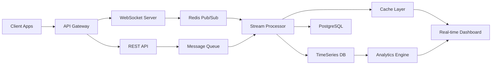

# 📊 실시간 평가 모니터링 시스템 설계
## 작성일: 2024-11-11  
## 작성자: Claude Opus 4.1
## 버전: 1.0.0

---

## 1. 시스템 개요

### 1.1 목적
실시간 평가 모니터링 시스템은 관리자와 평가자들이 평가 진행 상황을 실시간으로 추적하고, 데이터 기반 의사결정을 지원하는 종합 대시보드 시스템입니다.

### 1.2 핵심 기능
- 실시간 평가 진행률 추적
- 평가자별 활동 모니터링
- 일관성 지표 실시간 표시
- 이상 패턴 감지 및 알림
- 성과 메트릭 대시보드
- 예측 분석 및 추천

### 1.3 기술 스택
- **실시간 통신**: WebSocket (Socket.io)
- **스트리밍**: Server-Sent Events (SSE)
- **캐싱**: Redis Streams
- **메시징**: RabbitMQ / Kafka
- **모니터링**: Prometheus + Grafana
- **로깅**: ELK Stack (Elasticsearch, Logstash, Kibana)

---

## 2. 아키텍처 설계

### 2.1 시스템 아키텍처

```typescript
// 마이크로서비스 아키텍처
export interface MonitoringArchitecture {
  services: {
    apiGateway: 'Kong' | 'Nginx';
    realtimeService: 'Node.js + Socket.io';
    analyticsService: 'Python + FastAPI';
    notificationService: 'Node.js + Bull';
    dataProcessor: 'Apache Spark' | 'Flink';
  };
  
  dataFlow: {
    ingestion: 'Kafka';
    processing: 'Stream Processing';
    storage: 'TimeSeries DB + PostgreSQL';
    cache: 'Redis';
    delivery: 'WebSocket + SSE';
  };
  
  monitoring: {
    metrics: 'Prometheus';
    visualization: 'Grafana';
    logging: 'ELK Stack';
    tracing: 'Jaeger';
  };
}
```

### 2.2 데이터 플로우



---

## 3. 데이터베이스 설계

### 3.1 시계열 데이터 스키마

```sql
-- 실시간 이벤트 스트림
CREATE TABLE evaluation_events (
    id BIGSERIAL PRIMARY KEY,
    event_id UUID DEFAULT gen_random_uuid(),
    project_id UUID NOT NULL,
    evaluator_id UUID NOT NULL,
    event_type VARCHAR(50) NOT NULL,
    event_data JSONB NOT NULL,
    timestamp TIMESTAMP WITH TIME ZONE DEFAULT CURRENT_TIMESTAMP,
    processed BOOLEAN DEFAULT false,
    
    INDEX idx_events_timestamp (timestamp DESC),
    INDEX idx_events_project (project_id, timestamp DESC),
    INDEX idx_events_evaluator (evaluator_id, timestamp DESC)
) PARTITION BY RANGE (timestamp);

-- 월별 파티션
CREATE TABLE evaluation_events_2024_11 PARTITION OF evaluation_events
    FOR VALUES FROM ('2024-11-01') TO ('2024-12-01');

-- 실시간 메트릭
CREATE TABLE realtime_metrics (
    id BIGSERIAL PRIMARY KEY,
    project_id UUID NOT NULL,
    metric_name VARCHAR(100) NOT NULL,
    metric_value DECIMAL(10,4),
    dimensions JSONB,
    timestamp TIMESTAMP WITH TIME ZONE DEFAULT CURRENT_TIMESTAMP,
    
    INDEX idx_metrics_project_time (project_id, metric_name, timestamp DESC)
);

-- 평가자 활동 추적
CREATE TABLE evaluator_activities (
    id UUID PRIMARY KEY DEFAULT gen_random_uuid(),
    evaluator_id UUID NOT NULL REFERENCES evaluators(id),
    project_id UUID NOT NULL REFERENCES projects(id),
    session_id UUID,
    activity_type VARCHAR(50),
    details JSONB,
    ip_address INET,
    user_agent TEXT,
    duration_seconds INTEGER,
    timestamp TIMESTAMP WITH TIME ZONE DEFAULT CURRENT_TIMESTAMP,
    
    INDEX idx_activity_evaluator (evaluator_id, timestamp DESC),
    INDEX idx_activity_session (session_id)
);

-- 알림 큐
CREATE TABLE notification_queue (
    id UUID PRIMARY KEY DEFAULT gen_random_uuid(),
    recipient_id UUID NOT NULL,
    notification_type VARCHAR(50),
    priority INTEGER DEFAULT 5,
    title VARCHAR(255),
    message TEXT,
    data JSONB,
    channels JSONB DEFAULT '["email", "in_app"]',
    status VARCHAR(20) DEFAULT 'pending',
    scheduled_at TIMESTAMP WITH TIME ZONE,
    sent_at TIMESTAMP WITH TIME ZONE,
    read_at TIMESTAMP WITH TIME ZONE,
    error_message TEXT,
    retry_count INTEGER DEFAULT 0,
    
    INDEX idx_notif_recipient (recipient_id, status),
    INDEX idx_notif_scheduled (scheduled_at) WHERE status = 'pending'
);

-- 성능 스냅샷
CREATE TABLE performance_snapshots (
    id UUID PRIMARY KEY DEFAULT gen_random_uuid(),
    project_id UUID NOT NULL REFERENCES projects(id),
    snapshot_type VARCHAR(50),
    metrics JSONB NOT NULL,
    timestamp TIMESTAMP WITH TIME ZONE DEFAULT CURRENT_TIMESTAMP,
    
    INDEX idx_snapshot_project (project_id, timestamp DESC)
);
```

### 3.2 Redis 데이터 구조

```typescript
// Redis 키 구조
export const RedisSchema = {
  // 실시간 카운터
  counters: {
    activeUsers: 'monitor:active_users',
    onlineEvaluators: 'monitor:project:{projectId}:online',
    completedToday: 'monitor:completed:today:{date}'
  },
  
  // 실시간 진행률
  progress: {
    project: 'progress:project:{projectId}',
    evaluator: 'progress:evaluator:{evaluatorId}',
    node: 'progress:node:{nodeId}'
  },
  
  // 실시간 메트릭
  metrics: {
    throughput: 'metrics:throughput:{projectId}',
    latency: 'metrics:latency:{endpoint}',
    errorRate: 'metrics:errors:{service}'
  },
  
  // 세션 관리
  sessions: {
    active: 'sessions:active:{sessionId}',
    evaluator: 'sessions:evaluator:{evaluatorId}'
  },
  
  // 알림 채널
  pubsub: {
    updates: 'channel:updates:{projectId}',
    notifications: 'channel:notifications:{userId}',
    broadcasts: 'channel:broadcast:all'
  }
};
```

---

## 4. 실시간 모니터링 엔진

### 4.1 이벤트 처리 시스템

```typescript
export class RealTimeMonitoringEngine {
  private eventProcessor: EventProcessor;
  private metricsCollector: MetricsCollector;
  private anomalyDetector: AnomalyDetector;
  private notificationService: NotificationService;
  
  constructor(config: MonitoringConfig) {
    this.eventProcessor = new EventProcessor(config);
    this.metricsCollector = new MetricsCollector(config);
    this.anomalyDetector = new AnomalyDetector(config);
    this.notificationService = new NotificationService(config);
    
    this.initialize();
  }
  
  /**
   * 이벤트 스트림 처리
   */
  async processEventStream(event: EvaluationEvent): Promise<void> {
    // 1. 이벤트 검증
    if (!this.validateEvent(event)) {
      throw new Error('Invalid event format');
    }
    
    // 2. 실시간 메트릭 업데이트
    await this.updateMetrics(event);
    
    // 3. 상태 업데이트
    await this.updateState(event);
    
    // 4. 이상 탐지
    const anomalies = await this.detectAnomalies(event);
    
    // 5. 알림 발송
    if (anomalies.length > 0) {
      await this.sendAlerts(anomalies);
    }
    
    // 6. 브로드캐스트
    await this.broadcastUpdate(event);
    
    // 7. 로깅
    await this.logEvent(event);
  }
  
  /**
   * 메트릭 수집 및 집계
   */
  private async updateMetrics(event: EvaluationEvent): Promise<void> {
    const metrics = this.extractMetrics(event);
    
    // 실시간 카운터 업데이트
    await this.metricsCollector.increment(metrics.counters);
    
    // 게이지 업데이트
    await this.metricsCollector.gauge(metrics.gauges);
    
    // 히스토그램 업데이트
    await this.metricsCollector.histogram(metrics.histograms);
    
    // 시계열 데이터 저장
    await this.saveTimeSeriesData(metrics);
  }
  
  /**
   * 이상 패턴 감지
   */
  private async detectAnomalies(event: EvaluationEvent): Promise<Anomaly[]> {
    const anomalies: Anomaly[] = [];
    
    // 1. 통계적 이상치 탐지
    const statistical = await this.anomalyDetector.detectStatistical(event);
    if (statistical) anomalies.push(statistical);
    
    // 2. 패턴 기반 이상 탐지
    const pattern = await this.anomalyDetector.detectPattern(event);
    if (pattern) anomalies.push(pattern);
    
    // 3. 머신러닝 기반 탐지
    const ml = await this.anomalyDetector.detectML(event);
    if (ml) anomalies.push(ml);
    
    // 4. 규칙 기반 탐지
    const rules = await this.anomalyDetector.checkRules(event);
    anomalies.push(...rules);
    
    return anomalies;
  }
  
  /**
   * 실시간 브로드캐스트
   */
  private async broadcastUpdate(event: EvaluationEvent): Promise<void> {
    const update: RealtimeUpdate = {
      type: 'evaluation_update',
      projectId: event.projectId,
      timestamp: new Date(),
      data: {
        event,
        metrics: await this.getCurrentMetrics(event.projectId),
        progress: await this.getProgress(event.projectId),
        activeUsers: await this.getActiveUsers(event.projectId)
      }
    };
    
    // WebSocket 브로드캐스트
    await this.websocketServer.broadcast(
      `project:${event.projectId}`,
      update
    );
    
    // Redis Pub/Sub
    await this.redis.publish(
      `channel:updates:${event.projectId}`,
      JSON.stringify(update)
    );
  }
  
  /**
   * 메트릭 추출
   */
  private extractMetrics(event: EvaluationEvent): ExtractedMetrics {
    const metrics: ExtractedMetrics = {
      counters: {},
      gauges: {},
      histograms: {}
    };
    
    switch (event.type) {
      case 'comparison_submitted':
        metrics.counters['comparisons_total'] = 1;
        metrics.histograms['comparison_duration'] = event.duration;
        break;
        
      case 'node_completed':
        metrics.counters['nodes_completed'] = 1;
        metrics.gauges['consistency_ratio'] = event.consistencyRatio;
        break;
        
      case 'evaluation_started':
        metrics.counters['evaluations_started'] = 1;
        metrics.gauges['active_evaluations'] = 1;
        break;
        
      case 'evaluation_completed':
        metrics.counters['evaluations_completed'] = 1;
        metrics.gauges['active_evaluations'] = -1;
        metrics.histograms['evaluation_time'] = event.totalTime;
        break;
    }
    
    return metrics;
  }
}
```

### 4.2 실시간 진행률 추적

```typescript
export class ProgressTracker {
  private redis: RedisClient;
  private db: Database;
  private websocket: WebSocketServer;
  
  /**
   * 진행률 업데이트 및 브로드캐스트
   */
  async updateProgress(
    projectId: string,
    evaluatorId: string,
    nodeId: string,
    progress: number
  ): Promise<void> {
    // 1. Redis 업데이트 (빠른 읽기용)
    const key = `progress:${projectId}:${evaluatorId}:${nodeId}`;
    await this.redis.set(key, progress, 'EX', 3600);
    
    // 2. 집계 계산
    const overallProgress = await this.calculateOverallProgress(projectId);
    const evaluatorProgress = await this.calculateEvaluatorProgress(projectId, evaluatorId);
    
    // 3. DB 업데이트 (영구 저장)
    await this.saveProgressToDB({
      projectId,
      evaluatorId,
      nodeId,
      progress,
      overallProgress,
      timestamp: new Date()
    });
    
    // 4. 실시간 브로드캐스트
    await this.broadcastProgress({
      projectId,
      evaluatorId,
      nodeId,
      nodeProgress: progress,
      evaluatorProgress,
      overallProgress,
      timestamp: new Date()
    });
    
    // 5. 마일스톤 체크
    await this.checkMilestones(projectId, overallProgress);
  }
  
  /**
   * 전체 진행률 계산
   */
  private async calculateOverallProgress(projectId: string): Promise<ProgressMetrics> {
    // Redis에서 모든 진행률 데이터 가져오기
    const pattern = `progress:${projectId}:*`;
    const keys = await this.redis.keys(pattern);
    
    if (keys.length === 0) {
      return {
        overall: 0,
        byLevel: {},
        byEvaluator: {},
        estimated: null
      };
    }
    
    // 진행률 집계
    let totalProgress = 0;
    const levelProgress: Map<number, number[]> = new Map();
    const evaluatorProgress: Map<string, number[]> = new Map();
    
    for (const key of keys) {
      const parts = key.split(':');
      const evaluatorId = parts[2];
      const nodeId = parts[3];
      const progress = parseFloat(await this.redis.get(key) || '0');
      
      totalProgress += progress;
      
      // 레벨별 집계
      const nodeLevel = await this.getNodeLevel(nodeId);
      if (!levelProgress.has(nodeLevel)) {
        levelProgress.set(nodeLevel, []);
      }
      levelProgress.get(nodeLevel)!.push(progress);
      
      // 평가자별 집계
      if (!evaluatorProgress.has(evaluatorId)) {
        evaluatorProgress.set(evaluatorId, []);
      }
      evaluatorProgress.get(evaluatorId)!.push(progress);
    }
    
    // 평균 계산
    const overall = totalProgress / keys.length;
    
    const byLevel: Record<number, number> = {};
    for (const [level, progresses] of levelProgress) {
      byLevel[level] = progresses.reduce((a, b) => a + b, 0) / progresses.length;
    }
    
    const byEvaluator: Record<string, number> = {};
    for (const [evaluatorId, progresses] of evaluatorProgress) {
      byEvaluator[evaluatorId] = progresses.reduce((a, b) => a + b, 0) / progresses.length;
    }
    
    // 완료 시간 예측
    const estimated = await this.estimateCompletion(projectId, overall);
    
    return {
      overall,
      byLevel,
      byEvaluator,
      estimated
    };
  }
  
  /**
   * 완료 시간 예측
   */
  private async estimateCompletion(
    projectId: string,
    currentProgress: number
  ): Promise<CompletionEstimate | null> {
    // 과거 진행률 데이터 조회
    const history = await this.db.query<ProgressHistory>(
      `SELECT progress, timestamp 
       FROM performance_snapshots 
       WHERE project_id = $1 
         AND snapshot_type = 'progress'
       ORDER BY timestamp DESC 
       LIMIT 100`,
      [projectId]
    );
    
    if (history.length < 2) {
      return null;
    }
    
    // 선형 회귀로 진행 속도 계산
    const regression = this.linearRegression(
      history.map(h => h.timestamp.getTime()),
      history.map(h => h.progress)
    );
    
    // 100% 도달 시점 예측
    const remainingProgress = 100 - currentProgress;
    const estimatedTime = remainingProgress / regression.slope;
    
    return {
      estimatedCompletion: new Date(Date.now() + estimatedTime),
      confidence: regression.r2,
      progressRate: regression.slope,
      remainingTime: estimatedTime
    };
  }
  
  /**
   * 마일스톤 체크 및 알림
   */
  private async checkMilestones(
    projectId: string,
    progress: ProgressMetrics
  ): Promise<void> {
    const milestones = [25, 50, 75, 90, 100];
    
    for (const milestone of milestones) {
      const key = `milestone:${projectId}:${milestone}`;
      const alreadyReached = await this.redis.get(key);
      
      if (!alreadyReached && progress.overall >= milestone) {
        // 마일스톤 도달
        await this.redis.set(key, '1');
        
        // 알림 발송
        await this.notificationService.send({
          type: 'milestone_reached',
          projectId,
          milestone,
          progress: progress.overall,
          message: `Project reached ${milestone}% completion!`
        });
        
        // 이벤트 로깅
        await this.logMilestone(projectId, milestone, progress);
      }
    }
  }
}
```

### 4.3 이상 탐지 시스템

```typescript
export class AnomalyDetector {
  private threshold: AnomalyThresholds;
  private mlModel: TensorFlowModel;
  
  /**
   * 통계적 이상치 탐지 (Z-Score)
   */
  async detectStatistical(event: EvaluationEvent): Promise<Anomaly | null> {
    const historical = await this.getHistoricalData(event.type, event.projectId);
    
    if (historical.length < 30) {
      return null; // 충분한 데이터 없음
    }
    
    const values = historical.map(h => h.value);
    const mean = values.reduce((a, b) => a + b, 0) / values.length;
    const std = Math.sqrt(
      values.reduce((sum, v) => sum + Math.pow(v - mean, 2), 0) / values.length
    );
    
    const zScore = Math.abs((event.value - mean) / std);
    
    if (zScore > 3) {
      return {
        type: 'statistical',
        severity: zScore > 4 ? 'high' : 'medium',
        metric: event.type,
        value: event.value,
        expected: mean,
        deviation: zScore,
        message: `Unusual value detected: ${event.value} (Z-score: ${zScore.toFixed(2)})`
      };
    }
    
    return null;
  }
  
  /**
   * 패턴 기반 이상 탐지
   */
  async detectPattern(event: EvaluationEvent): Promise<Anomaly | null> {
    const patterns = await this.loadPatterns(event.projectId);
    
    for (const pattern of patterns) {
      if (this.matchesPattern(event, pattern)) {
        return {
          type: 'pattern',
          severity: pattern.severity,
          metric: event.type,
          pattern: pattern.name,
          message: pattern.description
        };
      }
    }
    
    return null;
  }
  
  /**
   * 머신러닝 기반 이상 탐지
   */
  async detectML(event: EvaluationEvent): Promise<Anomaly | null> {
    // 특징 추출
    const features = await this.extractFeatures(event);
    
    // 모델 예측
    const prediction = await this.mlModel.predict(features);
    
    if (prediction.isAnomaly && prediction.confidence > 0.8) {
      return {
        type: 'ml',
        severity: prediction.confidence > 0.9 ? 'high' : 'medium',
        metric: event.type,
        confidence: prediction.confidence,
        message: `ML model detected anomaly with ${(prediction.confidence * 100).toFixed(1)}% confidence`
      };
    }
    
    return null;
  }
  
  /**
   * 규칙 기반 탐지
   */
  async checkRules(event: EvaluationEvent): Promise<Anomaly[]> {
    const anomalies: Anomaly[] = [];
    const rules = await this.loadRules(event.projectId);
    
    for (const rule of rules) {
      if (await this.evaluateRule(event, rule)) {
        anomalies.push({
          type: 'rule',
          severity: rule.severity,
          metric: event.type,
          rule: rule.name,
          message: rule.message
        });
      }
    }
    
    return anomalies;
  }
  
  /**
   * 특징 추출
   */
  private async extractFeatures(event: EvaluationEvent): Promise<number[]> {
    const features: number[] = [];
    
    // 시간 특징
    const hour = new Date(event.timestamp).getHours();
    const dayOfWeek = new Date(event.timestamp).getDay();
    features.push(hour, dayOfWeek);
    
    // 빈도 특징
    const recentCount = await this.getRecentEventCount(event.evaluatorId, 3600);
    const avgInterval = await this.getAverageInterval(event.evaluatorId);
    features.push(recentCount, avgInterval);
    
    // 값 특징
    features.push(event.value || 0);
    
    // 컨텍스트 특징
    const sessionDuration = await this.getSessionDuration(event.sessionId);
    const completionRate = await this.getCompletionRate(event.evaluatorId);
    features.push(sessionDuration, completionRate);
    
    return features;
  }
  
  /**
   * 이상 패턴 정의
   */
  private patterns: AnomalyPattern[] = [
    {
      name: 'rapid_submission',
      description: 'Too many submissions in short time',
      severity: 'high',
      condition: (event) => event.rate > 10 // 10 per minute
    },
    {
      name: 'inconsistent_timing',
      description: 'Unusual evaluation timing pattern',
      severity: 'medium',
      condition: (event) => event.timeDeviation > 2
    },
    {
      name: 'extreme_values',
      description: 'Extreme comparison values detected',
      severity: 'high',
      condition: (event) => event.value === 9 || event.value === 1/9
    }
  ];
}
```

---

## 5. 대시보드 컴포넌트

### 5.1 실시간 대시보드 UI

```typescript
export class RealtimeDashboard extends React.Component<DashboardProps, DashboardState> {
  private websocket: WebSocket;
  private chartUpdateInterval: NodeJS.Timer;
  
  componentDidMount() {
    this.initializeWebSocket();
    this.loadInitialData();
    this.startPeriodicUpdates();
  }
  
  /**
   * WebSocket 초기화
   */
  private initializeWebSocket(): void {
    const wsUrl = `wss://${config.wsHost}/monitoring/${this.props.projectId}`;
    
    this.websocket = new WebSocket(wsUrl);
    
    this.websocket.onopen = () => {
      console.log('Monitoring WebSocket connected');
      this.setState({ connectionStatus: 'connected' });
    };
    
    this.websocket.onmessage = (event) => {
      const update = JSON.parse(event.data);
      this.handleRealtimeUpdate(update);
    };
    
    this.websocket.onerror = (error) => {
      console.error('WebSocket error:', error);
      this.setState({ connectionStatus: 'error' });
    };
    
    this.websocket.onclose = () => {
      console.log('WebSocket disconnected, reconnecting...');
      this.setState({ connectionStatus: 'disconnected' });
      setTimeout(() => this.initializeWebSocket(), 5000);
    };
  }
  
  /**
   * 실시간 업데이트 처리
   */
  private handleRealtimeUpdate(update: RealtimeUpdate): void {
    switch (update.type) {
      case 'progress_update':
        this.updateProgressMetrics(update.data);
        break;
        
      case 'evaluator_activity':
        this.updateEvaluatorStatus(update.data);
        break;
        
      case 'consistency_check':
        this.updateConsistencyMetrics(update.data);
        break;
        
      case 'anomaly_detected':
        this.showAnomalyAlert(update.data);
        break;
        
      case 'milestone_reached':
        this.celebrateMilestone(update.data);
        break;
    }
  }
  
  render() {
    return (
      <div className="realtime-dashboard">
        {/* 연결 상태 표시 */}
        <ConnectionStatus status={this.state.connectionStatus} />
        
        {/* 핵심 지표 카드 */}
        <div className="metrics-grid">
          <MetricCard
            title="Active Evaluators"
            value={this.state.activeEvaluators}
            trend={this.state.evaluatorTrend}
            icon={<UserIcon />}
            color="blue"
          />
          
          <MetricCard
            title="Overall Progress"
            value={`${this.state.overallProgress}%`}
            trend={this.state.progressTrend}
            icon={<ProgressIcon />}
            color="green"
          />
          
          <MetricCard
            title="Avg Consistency"
            value={this.state.avgConsistency.toFixed(3)}
            trend={this.state.consistencyTrend}
            icon={<CheckIcon />}
            color={this.state.avgConsistency < 0.1 ? 'green' : 'orange'}
          />
          
          <MetricCard
            title="Completion ETA"
            value={this.formatETA(this.state.estimatedCompletion)}
            icon={<ClockIcon />}
            color="purple"
          />
        </div>
        
        {/* 실시간 차트 */}
        <div className="charts-container">
          <RealtimeChart
            title="Evaluation Progress"
            data={this.state.progressHistory}
            type="area"
            streaming={true}
          />
          
          <RealtimeChart
            title="Active Users"
            data={this.state.activeUsersHistory}
            type="line"
            streaming={true}
          />
          
          <HeatmapChart
            title="Activity Heatmap"
            data={this.state.activityHeatmap}
            xAxis="Hour"
            yAxis="Day"
          />
        </div>
        
        {/* 평가자 테이블 */}
        <EvaluatorTable
          evaluators={this.state.evaluators}
          onSort={this.handleSort}
          onFilter={this.handleFilter}
        />
        
        {/* 알림 패널 */}
        <NotificationPanel
          notifications={this.state.notifications}
          onDismiss={this.dismissNotification}
        />
      </div>
    );
  }
}
```

### 5.2 차트 컴포넌트

```typescript
export class RealtimeChart extends React.Component<ChartProps> {
  private chart: Chart;
  private dataBuffer: ChartData[] = [];
  private updateInterval: NodeJS.Timer;
  
  componentDidMount() {
    this.initializeChart();
    
    if (this.props.streaming) {
      this.startStreaming();
    }
  }
  
  /**
   * 차트 초기화
   */
  private initializeChart(): void {
    const ctx = this.canvasRef.current?.getContext('2d');
    
    this.chart = new Chart(ctx, {
      type: this.props.type,
      data: {
        datasets: [{
          label: this.props.title,
          data: this.props.data,
          borderColor: this.props.color || 'rgb(75, 192, 192)',
          backgroundColor: this.props.color 
            ? `${this.props.color}33` 
            : 'rgba(75, 192, 192, 0.2)',
          tension: 0.4
        }]
      },
      options: {
        responsive: true,
        maintainAspectRatio: false,
        scales: {
          x: {
            type: 'time',
            time: {
              displayFormats: {
                minute: 'HH:mm',
                hour: 'HH:mm'
              }
            }
          },
          y: {
            beginAtZero: true,
            max: this.props.maxY
          }
        },
        plugins: {
          streaming: this.props.streaming ? {
            duration: 20000, // 20 seconds of data
            refresh: 1000, // refresh every second
            delay: 1000,
            onRefresh: (chart) => this.onChartRefresh(chart)
          } : undefined
        }
      }
    });
  }
  
  /**
   * 스트리밍 업데이트
   */
  private onChartRefresh(chart: Chart): void {
    // 버퍼에서 새 데이터 가져오기
    while (this.dataBuffer.length > 0) {
      const data = this.dataBuffer.shift()!;
      chart.data.datasets[0].data.push({
        x: data.timestamp,
        y: data.value
      });
    }
    
    // 오래된 데이터 제거
    const cutoff = Date.now() - 20000;
    chart.data.datasets[0].data = chart.data.datasets[0].data.filter(
      (point: any) => point.x > cutoff
    );
  }
  
  /**
   * 새 데이터 추가
   */
  public addDataPoint(value: number, timestamp: Date = new Date()): void {
    this.dataBuffer.push({ value, timestamp });
    
    if (!this.props.streaming) {
      this.chart.data.datasets[0].data.push({
        x: timestamp,
        y: value
      });
      this.chart.update('none'); // No animation for real-time
    }
  }
}
```

---

## 6. 알림 시스템

### 6.1 알림 엔진

```typescript
export class NotificationEngine {
  private emailService: EmailService;
  private pushService: PushNotificationService;
  private smsService: SMSService;
  private inAppService: InAppNotificationService;
  
  /**
   * 알림 발송 오케스트레이션
   */
  async sendNotification(notification: Notification): Promise<void> {
    // 1. 우선순위 확인
    if (notification.priority === 'critical') {
      await this.sendImmediate(notification);
    } else {
      await this.queueNotification(notification);
    }
  }
  
  /**
   * 즉시 발송
   */
  private async sendImmediate(notification: Notification): Promise<void> {
    const promises: Promise<any>[] = [];
    
    // 모든 채널로 동시 발송
    if (notification.channels.includes('email')) {
      promises.push(this.emailService.send(notification));
    }
    
    if (notification.channels.includes('push')) {
      promises.push(this.pushService.send(notification));
    }
    
    if (notification.channels.includes('sms') && notification.priority === 'critical') {
      promises.push(this.smsService.send(notification));
    }
    
    if (notification.channels.includes('in_app')) {
      promises.push(this.inAppService.send(notification));
    }
    
    const results = await Promise.allSettled(promises);
    
    // 실패한 발송 재시도
    const failed = results.filter(r => r.status === 'rejected');
    if (failed.length > 0) {
      await this.retryFailed(notification, failed);
    }
  }
  
  /**
   * 알림 규칙 정의
   */
  private rules: NotificationRule[] = [
    {
      trigger: 'consistency_low',
      condition: (data) => data.consistencyRatio > 0.15,
      template: {
        title: 'Low Consistency Detected',
        message: 'Consistency ratio is {consistencyRatio}. Please review your evaluations.',
        priority: 'high',
        channels: ['email', 'in_app']
      }
    },
    {
      trigger: 'evaluation_complete',
      condition: (data) => data.progress === 100,
      template: {
        title: 'Evaluation Completed',
        message: 'Your evaluation for {projectName} is complete!',
        priority: 'medium',
        channels: ['email', 'push']
      }
    },
    {
      trigger: 'deadline_approaching',
      condition: (data) => data.hoursRemaining <= 24,
      template: {
        title: 'Deadline Approaching',
        message: 'Only {hoursRemaining} hours left to complete your evaluation.',
        priority: 'high',
        channels: ['email', 'push', 'in_app']
      }
    },
    {
      trigger: 'anomaly_detected',
      condition: (data) => data.anomaly.severity === 'high',
      template: {
        title: 'Unusual Activity Detected',
        message: 'System detected unusual activity: {anomaly.message}',
        priority: 'critical',
        channels: ['email', 'sms', 'push']
      }
    }
  ];
}
```

---

## 7. 성능 최적화

### 7.1 데이터 집계 최적화

```typescript
export class DataAggregator {
  private cache: LRUCache<string, any>;
  private aggregationWorkers: Worker[];
  
  /**
   * 시계열 데이터 집계
   */
  async aggregateTimeSeries(
    projectId: string,
    metric: string,
    interval: TimeInterval
  ): Promise<TimeSeriesData> {
    const cacheKey = `ts:${projectId}:${metric}:${interval}`;
    
    // 캐시 확인
    const cached = this.cache.get(cacheKey);
    if (cached && cached.timestamp > Date.now() - 60000) {
      return cached.data;
    }
    
    // TimescaleDB 하이퍼테이블 쿼리
    const query = `
      SELECT 
        time_bucket($1, timestamp) as bucket,
        AVG(metric_value) as avg_value,
        MAX(metric_value) as max_value,
        MIN(metric_value) as min_value,
        COUNT(*) as count
      FROM realtime_metrics
      WHERE project_id = $2
        AND metric_name = $3
        AND timestamp >= NOW() - INTERVAL '1 day'
      GROUP BY bucket
      ORDER BY bucket DESC
    `;
    
    const result = await this.db.query(query, [interval, projectId, metric]);
    
    // 캐시 저장
    this.cache.set(cacheKey, {
      data: result,
      timestamp: Date.now()
    });
    
    return result;
  }
  
  /**
   * 실시간 윈도우 집계
   */
  async windowAggregate(
    stream: Observable<Event>,
    windowSize: number,
    aggregateFunc: AggregateFunction
  ): Promise<Observable<AggregateResult>> {
    return stream.pipe(
      bufferTime(windowSize),
      map(events => aggregateFunc(events)),
      filter(result => result !== null)
    );
  }
}
```

### 7.2 WebSocket 연결 관리

```typescript
export class WebSocketManager {
  private connections: Map<string, WebSocketConnection>;
  private connectionPool: ConnectionPool;
  
  /**
   * 연결 풀 관리
   */
  async manageConnectionPool(): Promise<void> {
    setInterval(() => {
      // 유휴 연결 정리
      for (const [id, conn] of this.connections) {
        if (conn.idleTime > 300000) { // 5분
          this.closeConnection(id);
        }
      }
      
      // 연결 상태 모니터링
      this.monitorConnections();
      
      // 부하 분산
      this.balanceLoad();
    }, 30000);
  }
  
  /**
   * 메시지 배칭
   */
  async batchMessages(
    messages: Message[],
    targetConnection: string
  ): Promise<void> {
    const batch: MessageBatch = {
      id: generateUUID(),
      messages,
      timestamp: new Date(),
      compressed: messages.length > 10
    };
    
    if (batch.compressed) {
      batch.data = await this.compress(messages);
    }
    
    await this.sendBatch(targetConnection, batch);
  }
}
```

---

## 8. 모니터링 메트릭

### 8.1 Prometheus 메트릭 정의

```yaml
# prometheus_rules.yml
groups:
  - name: ahp_monitoring
    interval: 30s
    rules:
      - record: ahp:evaluations:rate5m
        expr: rate(evaluations_completed_total[5m])
      
      - record: ahp:consistency:avg
        expr: avg(consistency_ratio) by (project_id)
      
      - record: ahp:response_time:p95
        expr: histogram_quantile(0.95, response_time_bucket)
      
      - alert: HighInconsistencyRate
        expr: ahp:consistency:avg > 0.15
        for: 5m
        labels:
          severity: warning
        annotations:
          summary: "High inconsistency rate detected"
      
      - alert: SlowResponseTime
        expr: ahp:response_time:p95 > 2000
        for: 10m
        labels:
          severity: critical
        annotations:
          summary: "Response time exceeding threshold"
```

### 8.2 Grafana 대시보드 설정

```json
{
  "dashboard": {
    "title": "AHP Real-time Monitoring",
    "panels": [
      {
        "id": 1,
        "title": "Evaluation Progress",
        "type": "graph",
        "targets": [
          {
            "expr": "ahp:evaluations:rate5m",
            "legendFormat": "Evaluations/min"
          }
        ]
      },
      {
        "id": 2,
        "title": "Active Users",
        "type": "stat",
        "targets": [
          {
            "expr": "sum(active_evaluators)"
          }
        ]
      },
      {
        "id": 3,
        "title": "Consistency Distribution",
        "type": "histogram",
        "targets": [
          {
            "expr": "consistency_ratio",
            "format": "heatmap"
          }
        ]
      }
    ]
  }
}
```

---

## 9. 구현 가이드라인

### 9.1 Sonnet 구현 체크리스트

```markdown
## Backend Implementation
- [ ] WebSocket 서버 설정
- [ ] Redis Streams 구성
- [ ] 이벤트 프로세서 구현
- [ ] 메트릭 수집기 구현
- [ ] 알림 큐 시스템

## Frontend Implementation
- [ ] 실시간 대시보드 컴포넌트
- [ ] WebSocket 클라이언트
- [ ] 차트 라이브러리 통합
- [ ] 알림 UI 컴포넌트
- [ ] 진행률 표시 위젯

## DevOps
- [ ] Prometheus 설정
- [ ] Grafana 대시보드
- [ ] ELK Stack 구성
- [ ] 알림 규칙 설정
```

---

## 10. 마무리

실시간 평가 모니터링 시스템 설계를 완료했습니다.
WebSocket 기반 실시간 통신, 이상 탐지, 성능 최적화 등
포괄적인 모니터링 솔루션을 제공합니다.

**문서 작성 완료**: 2024-11-11
**총 설계 문서**: 5개 완성