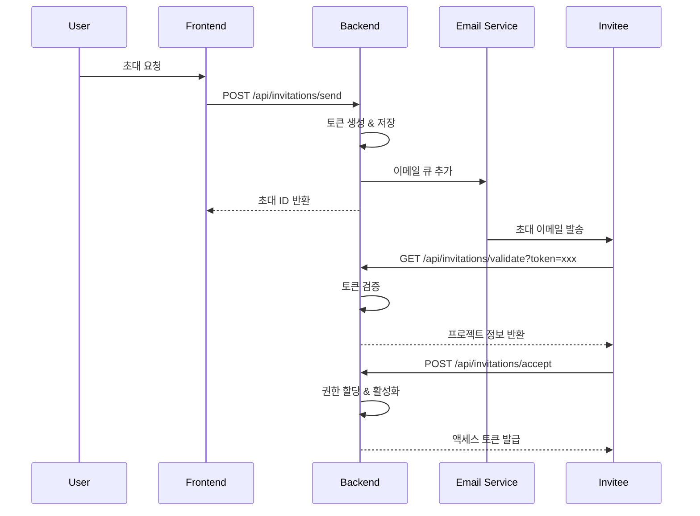

# 🔐 AHP 평가 초대 시스템 상세 설계
**작성일**: 2024-11-29  
**작성자**: Claude Opus 4.1  
**버전**: 1.0

## 1. 시스템 개요

### 1.1 목적
AHP 평가 프로세스에 외부 전문가 및 이해관계자를 안전하게 초대하고, 세분화된 권한 관리를 통해 협업적 의사결정을 가능하게 하는 시스템

### 1.2 핵심 요구사항
- 이메일 기반 초대 발송 및 관리
- JWT 토큰 기반 보안 인증
- 역할 기반 접근 제어 (RBAC)
- 초대 상태 실시간 추적
- 만료 시간 자동 관리
- 권한 세분화 및 동적 할당

---

## 2. 시스템 아키텍처

### 2.1 전체 구조
```
┌─────────────────────────────────────────────────┐
│                  Frontend (React)                │
├─────────────────────────────────────────────────┤
│           Invitation Management UI               │
│         ├── InviteModal Component                │
│         ├── ParticipantList Component            │
│         └── PermissionMatrix Component           │
└─────────────────────────────────────────────────┘
                         │
                    WebSocket/REST
                         │
┌─────────────────────────────────────────────────┐
│               Backend (Django)                   │
├─────────────────────────────────────────────────┤
│         Invitation Service Layer                 │
│         ├── Token Generator                      │
│         ├── Permission Manager                   │
│         └── Email Queue Manager                  │
├─────────────────────────────────────────────────┤
│              Data Layer                          │
│         ├── PostgreSQL (Main DB)                 │
│         ├── Redis (Token Cache)                  │
│         └── Celery (Task Queue)                  │
└─────────────────────────────────────────────────┘
```

### 2.2 데이터 플로우


---

## 3. 데이터베이스 설계

### 3.1 핵심 테이블 스키마

```sql
-- 초대 테이블
CREATE TABLE evaluation_invitations (
    id UUID PRIMARY KEY DEFAULT gen_random_uuid(),
    project_id UUID NOT NULL REFERENCES projects(id) ON DELETE CASCADE,
    inviter_id UUID NOT NULL REFERENCES users(id),
    invitee_email VARCHAR(255) NOT NULL,
    invitee_name VARCHAR(100),
    token VARCHAR(512) UNIQUE NOT NULL,
    token_hash VARCHAR(256) NOT NULL, -- 보안을 위한 해시값
    role VARCHAR(50) NOT NULL DEFAULT 'evaluator',
    custom_message TEXT,
    permissions JSONB NOT NULL DEFAULT '{}',
    status VARCHAR(50) NOT NULL DEFAULT 'pending',
    expires_at TIMESTAMP NOT NULL,
    reminder_count INT DEFAULT 0,
    last_reminder_at TIMESTAMP,
    created_at TIMESTAMP DEFAULT NOW(),
    accepted_at TIMESTAMP,
    rejected_at TIMESTAMP,
    revoked_at TIMESTAMP,
    
    -- 인덱스
    INDEX idx_token_hash (token_hash),
    INDEX idx_project_status (project_id, status),
    INDEX idx_invitee_email (invitee_email),
    INDEX idx_expires_at (expires_at)
);

-- 참여자 권한 테이블
CREATE TABLE participant_permissions (
    id UUID PRIMARY KEY DEFAULT gen_random_uuid(),
    user_id UUID REFERENCES users(id) ON DELETE CASCADE,
    project_id UUID NOT NULL REFERENCES projects(id) ON DELETE CASCADE,
    invitation_id UUID REFERENCES evaluation_invitations(id),
    
    -- 역할 정의
    role VARCHAR(50) NOT NULL,
    role_priority INT NOT NULL DEFAULT 100,
    
    -- 세부 권한
    can_view_project BOOLEAN DEFAULT true,
    can_view_criteria BOOLEAN DEFAULT true,
    can_view_evaluations BOOLEAN DEFAULT true,
    can_view_results BOOLEAN DEFAULT false,
    can_create_evaluation BOOLEAN DEFAULT false,
    can_edit_own_evaluation BOOLEAN DEFAULT false,
    can_edit_all_evaluations BOOLEAN DEFAULT false,
    can_manage_criteria BOOLEAN DEFAULT false,
    can_invite_others BOOLEAN DEFAULT false,
    can_export_data BOOLEAN DEFAULT false,
    can_delete_project BOOLEAN DEFAULT false,
    
    -- 메타데이터
    assigned_by UUID REFERENCES users(id),
    created_at TIMESTAMP DEFAULT NOW(),
    updated_at TIMESTAMP DEFAULT NOW(),
    expires_at TIMESTAMP,
    
    -- 복합 유니크 제약
    UNIQUE(user_id, project_id)
);

-- 초대 활동 로그
CREATE TABLE invitation_activities (
    id UUID PRIMARY KEY DEFAULT gen_random_uuid(),
    invitation_id UUID NOT NULL REFERENCES evaluation_invitations(id),
    action VARCHAR(50) NOT NULL,
    actor_id UUID REFERENCES users(id),
    actor_ip INET,
    user_agent TEXT,
    metadata JSONB DEFAULT '{}',
    created_at TIMESTAMP DEFAULT NOW(),
    
    INDEX idx_invitation_activities (invitation_id, created_at DESC)
);

-- 권한 템플릿 (사전 정의된 역할)
CREATE TABLE permission_templates (
    id UUID PRIMARY KEY DEFAULT gen_random_uuid(),
    name VARCHAR(100) UNIQUE NOT NULL,
    description TEXT,
    permissions JSONB NOT NULL,
    is_system BOOLEAN DEFAULT false,
    created_at TIMESTAMP DEFAULT NOW()
);
```

### 3.2 역할 및 권한 매트릭스

```python
ROLE_PERMISSIONS = {
    'owner': {
        'priority': 0,
        'permissions': {
            'can_view_project': True,
            'can_view_criteria': True,
            'can_view_evaluations': True,
            'can_view_results': True,
            'can_create_evaluation': True,
            'can_edit_own_evaluation': True,
            'can_edit_all_evaluations': True,
            'can_manage_criteria': True,
            'can_invite_others': True,
            'can_export_data': True,
            'can_delete_project': True
        }
    },
    'admin': {
        'priority': 10,
        'permissions': {
            'can_view_project': True,
            'can_view_criteria': True,
            'can_view_evaluations': True,
            'can_view_results': True,
            'can_create_evaluation': True,
            'can_edit_own_evaluation': True,
            'can_edit_all_evaluations': True,
            'can_manage_criteria': True,
            'can_invite_others': True,
            'can_export_data': True,
            'can_delete_project': False
        }
    },
    'evaluator': {
        'priority': 50,
        'permissions': {
            'can_view_project': True,
            'can_view_criteria': True,
            'can_view_evaluations': False,
            'can_view_results': False,
            'can_create_evaluation': True,
            'can_edit_own_evaluation': True,
            'can_edit_all_evaluations': False,
            'can_manage_criteria': False,
            'can_invite_others': False,
            'can_export_data': False,
            'can_delete_project': False
        }
    },
    'viewer': {
        'priority': 100,
        'permissions': {
            'can_view_project': True,
            'can_view_criteria': True,
            'can_view_evaluations': True,
            'can_view_results': True,
            'can_create_evaluation': False,
            'can_edit_own_evaluation': False,
            'can_edit_all_evaluations': False,
            'can_manage_criteria': False,
            'can_invite_others': False,
            'can_export_data': True,
            'can_delete_project': False
        }
    }
}
```

---

## 4. 보안 토큰 시스템

### 4.1 JWT 토큰 구조

```python
import jwt
import secrets
from datetime import datetime, timedelta
from typing import Dict, Any

class InvitationTokenManager:
    """초대 토큰 생성 및 검증 관리자"""
    
    def __init__(self, secret_key: str, algorithm: str = 'HS256'):
        self.secret_key = secret_key
        self.algorithm = algorithm
        self.token_length = 32  # URL-safe token length
    
    def generate_invitation_token(
        self,
        invitation_id: str,
        project_id: str,
        invitee_email: str,
        role: str,
        expires_in_days: int = 7
    ) -> Dict[str, Any]:
        """보안 초대 토큰 생성"""
        
        # 1. 고유 토큰 생성
        url_token = secrets.token_urlsafe(self.token_length)
        
        # 2. JWT 페이로드 구성
        payload = {
            'invitation_id': invitation_id,
            'project_id': project_id,
            'email': invitee_email,
            'role': role,
            'token': url_token,
            'iat': datetime.utcnow(),
            'exp': datetime.utcnow() + timedelta(days=expires_in_days),
            'type': 'invitation'
        }
        
        # 3. JWT 토큰 생성
        jwt_token = jwt.encode(payload, self.secret_key, algorithm=self.algorithm)
        
        # 4. 토큰 해시 (DB 저장용)
        import hashlib
        token_hash = hashlib.sha256(url_token.encode()).hexdigest()
        
        return {
            'url_token': url_token,
            'jwt_token': jwt_token,
            'token_hash': token_hash,
            'expires_at': payload['exp']
        }
    
    def verify_invitation_token(self, token: str) -> Dict[str, Any]:
        """토큰 검증 및 정보 추출"""
        
        try:
            # JWT 디코딩
            payload = jwt.decode(
                token, 
                self.secret_key, 
                algorithms=[self.algorithm]
            )
            
            # 토큰 타입 확인
            if payload.get('type') != 'invitation':
                raise ValueError("Invalid token type")
            
            # 만료 시간 확인
            if datetime.utcnow() > datetime.fromtimestamp(payload['exp']):
                raise jwt.ExpiredSignatureError("Token has expired")
            
            return {
                'valid': True,
                'payload': payload
            }
            
        except jwt.ExpiredSignatureError:
            return {'valid': False, 'error': 'Token expired'}
        except jwt.InvalidTokenError:
            return {'valid': False, 'error': 'Invalid token'}
        except Exception as e:
            return {'valid': False, 'error': str(e)}
```

### 4.2 토큰 캐싱 전략 (Redis)

```python
import redis
import json
from typing import Optional

class TokenCache:
    """Redis 기반 토큰 캐시 관리"""
    
    def __init__(self, redis_client: redis.Redis):
        self.redis = redis_client
        self.prefix = "invitation:token:"
    
    def set_token(
        self, 
        token_hash: str, 
        invitation_data: dict, 
        ttl_seconds: int
    ):
        """토큰 정보 캐싱"""
        key = f"{self.prefix}{token_hash}"
        self.redis.setex(
            key,
            ttl_seconds,
            json.dumps(invitation_data)
        )
    
    def get_token(self, token_hash: str) -> Optional[dict]:
        """캐시된 토큰 정보 조회"""
        key = f"{self.prefix}{token_hash}"
        data = self.redis.get(key)
        return json.loads(data) if data else None
    
    def invalidate_token(self, token_hash: str):
        """토큰 무효화"""
        key = f"{self.prefix}{token_hash}"
        self.redis.delete(key)
    
    def extend_token_ttl(self, token_hash: str, additional_seconds: int):
        """토큰 만료 시간 연장"""
        key = f"{self.prefix}{token_hash}"
        current_ttl = self.redis.ttl(key)
        if current_ttl > 0:
            self.redis.expire(key, current_ttl + additional_seconds)
```

---

## 5. 이메일 발송 시스템

### 5.1 Celery 큐 설계

```python
from celery import Celery, Task
from typing import Dict, List
import smtplib
from email.mime.text import MIMEText
from email.mime.multipart import MIMEMultipart

# Celery 설정
celery_app = Celery('ahp_platform')
celery_app.config_from_object('django.conf:settings', namespace='CELERY')

class EmailTask(Task):
    """이메일 발송 기본 태스크"""
    
    autoretry_for = (smtplib.SMTPException,)
    retry_kwargs = {'max_retries': 3}
    retry_backoff = True
    retry_backoff_max = 600
    retry_jitter = True

@celery_app.task(base=EmailTask, name='send_invitation_email')
def send_invitation_email(
    invitation_id: str,
    recipient_email: str,
    invitation_data: Dict
) -> bool:
    """초대 이메일 비동기 발송"""
    
    try:
        # 이메일 템플릿 렌더링
        email_content = render_invitation_template(invitation_data)
        
        # 이메일 구성
        message = MIMEMultipart('alternative')
        message['Subject'] = f"초대: {invitation_data['project_name']} 평가 참여"
        message['From'] = settings.EMAIL_FROM
        message['To'] = recipient_email
        
        # HTML 및 텍스트 버전 추가
        html_part = MIMEText(email_content['html'], 'html')
        text_part = MIMEText(email_content['text'], 'plain')
        
        message.attach(text_part)
        message.attach(html_part)
        
        # SMTP 발송
        with smtplib.SMTP(settings.EMAIL_HOST, settings.EMAIL_PORT) as server:
            server.starttls()
            server.login(settings.EMAIL_HOST_USER, settings.EMAIL_HOST_PASSWORD)
            server.send_message(message)
        
        # 발송 로그 기록
        log_email_sent(invitation_id, recipient_email, 'success')
        return True
        
    except Exception as e:
        log_email_sent(invitation_id, recipient_email, 'failed', str(e))
        raise

@celery_app.task(name='send_reminder_email')
def send_reminder_email(invitation_id: str) -> bool:
    """미수락 초대 리마인더 발송"""
    
    invitation = get_invitation(invitation_id)
    
    if invitation.status != 'pending':
        return False
    
    if invitation.reminder_count >= 3:
        return False
    
    # 리마인더 발송
    send_invitation_email.delay(
        invitation_id,
        invitation.invitee_email,
        prepare_reminder_data(invitation)
    )
    
    # 리마인더 카운트 업데이트
    invitation.reminder_count += 1
    invitation.last_reminder_at = datetime.utcnow()
    invitation.save()
    
    return True
```

### 5.2 이메일 템플릿 시스템

```python
from jinja2 import Template

class InvitationEmailTemplate:
    """초대 이메일 템플릿 관리"""
    
    HTML_TEMPLATE = """
    <!DOCTYPE html>
    <html>
    <head>
        <style>
            .container { max-width: 600px; margin: 0 auto; font-family: Arial, sans-serif; }
            .header { background: #4CAF50; color: white; padding: 20px; text-align: center; }
            .content { padding: 30px; background: #f5f5f5; }
            .button { 
                display: inline-block; 
                padding: 12px 30px; 
                background: #4CAF50; 
                color: white; 
                text-decoration: none; 
                border-radius: 5px;
                margin: 20px 0;
            }
            .footer { padding: 20px; text-align: center; color: #666; font-size: 12px; }
            .permissions { background: white; padding: 15px; margin: 20px 0; border-radius: 5px; }
            .permission-item { padding: 5px 0; }
        </style>
    </head>
    <body>
        <div class="container">
            <div class="header">
                <h1>AHP 평가 초대</h1>
            </div>
            <div class="content">
                <h2>안녕하세요, {{ invitee_name }}님</h2>
                <p>{{ inviter_name }}님이 '{{ project_name }}' 프로젝트의 평가에 참여하도록 초대했습니다.</p>
                
                
                <div style="background: white; padding: 15px; margin: 20px 0; border-left: 4px solid #4CAF50;">
                    <strong>초대 메시지:</strong><br>
                    {{ custom_message }}
                </div>
                
                
                <div class="permissions">
                    <h3>귀하의 역할: {{ role }}</h3>
                    <div class="permission-item">✓ 프로젝트 및 평가 기준 열람</div>
                    
                    <div class="permission-item">✓ 평가 참여 및 의견 제시</div>
                    
                    
                    <div class="permission-item">✓ 평가 결과 확인</div>
                    
                </div>
                
                <div style="text-align: center;">
                    <a href="{{ accept_url }}" class="button">초대 수락하기</a>
                </div>
                
                <p style="color: #666; font-size: 14px;">
                    이 초대는 {{ expires_at }}까지 유효합니다.<br>
                    초대를 수락하지 않으려면 이 이메일을 무시하셔도 됩니다.
                </p>
            </div>
            <div class="footer">
                <p>이 이메일은 AHP 의사결정 플랫폼에서 자동으로 발송되었습니다.</p>
                <p>문의사항이 있으시면 {{ support_email }}로 연락주시기 바랍니다.</p>
            </div>
        </div>
    </body>
    </html>
    """
    
    @classmethod
    def render(cls, context: dict) -> str:
        """템플릿 렌더링"""
        template = Template(cls.HTML_TEMPLATE)
        return template.render(**context)
```

---

## 6. API 엔드포인트 설계

### 6.1 REST API 명세

```python
from rest_framework import serializers, viewsets, status
from rest_framework.decorators import action
from rest_framework.response import Response

class InvitationSerializer(serializers.ModelSerializer):
    """초대 시리얼라이저"""
    
    class Meta:
        model = EvaluationInvitation
        fields = [
            'id', 'project_id', 'invitee_email', 'invitee_name',
            'role', 'custom_message', 'permissions', 'status',
            'expires_at', 'created_at', 'accepted_at'
        ]
        read_only_fields = ['id', 'status', 'created_at', 'accepted_at']
    
    def validate_permissions(self, value):
        """권한 유효성 검증"""
        allowed_permissions = set(ROLE_PERMISSIONS['viewer']['permissions'].keys())
        provided_permissions = set(value.keys())
        
        if not provided_permissions.issubset(allowed_permissions):
            raise serializers.ValidationError("Invalid permissions provided")
        
        return value

class InvitationViewSet(viewsets.ModelViewSet):
    """초대 관리 ViewSet"""
    
    serializer_class = InvitationSerializer
    permission_classes = [IsAuthenticated, HasProjectPermission]
    
    def get_queryset(self):
        """프로젝트별 초대 목록 조회"""
        user = self.request.user
        project_id = self.request.query_params.get('project_id')
        
        queryset = EvaluationInvitation.objects.filter(
            project_id=project_id
        ).select_related('project', 'inviter')
        
        # 권한에 따른 필터링
        if not user.has_perm('can_invite_others', project_id):
            queryset = queryset.filter(inviter=user)
        
        return queryset
    
    @action(detail=False, methods=['post'])
    def send(self, request):
        """초대 발송 API"""
        
        serializer = self.get_serializer(data=request.data)
        serializer.is_valid(raise_exception=True)
        
        # 초대 생성
        invitation = serializer.save(inviter=request.user)
        
        # 토큰 생성
        token_manager = InvitationTokenManager(settings.SECRET_KEY)
        token_data = token_manager.generate_invitation_token(
            str(invitation.id),
            str(invitation.project_id),
            invitation.invitee_email,
            invitation.role
        )
        
        # DB 저장
        invitation.token = token_data['url_token']
        invitation.token_hash = token_data['token_hash']
        invitation.save()
        
        # 이메일 발송 (비동기)
        send_invitation_email.delay(
            str(invitation.id),
            invitation.invitee_email,
            self.prepare_email_context(invitation, token_data['url_token'])
        )
        
        return Response(
            {'id': invitation.id, 'status': 'sent'},
            status=status.HTTP_201_CREATED
        )
    
    @action(detail=False, methods=['get'])
    def validate(self, request):
        """토큰 검증 API"""
        
        token = request.query_params.get('token')
        
        if not token:
            return Response(
                {'error': 'Token required'},
                status=status.HTTP_400_BAD_REQUEST
            )
        
        # 토큰 해시 계산
        import hashlib
        token_hash = hashlib.sha256(token.encode()).hexdigest()
        
        # 캐시 확인
        cache = TokenCache(redis_client)
        cached_data = cache.get_token(token_hash)
        
        if cached_data:
            return Response(cached_data)
        
        # DB 조회
        try:
            invitation = EvaluationInvitation.objects.get(
                token_hash=token_hash,
                status='pending'
            )
            
            # 만료 확인
            if invitation.expires_at < timezone.now():
                invitation.status = 'expired'
                invitation.save()
                return Response(
                    {'error': 'Invitation expired'},
                    status=status.HTTP_400_BAD_REQUEST
                )
            
            # 캐시 저장
            response_data = {
                'invitation_id': str(invitation.id),
                'project_id': str(invitation.project_id),
                'project_name': invitation.project.name,
                'role': invitation.role,
                'permissions': invitation.permissions
            }
            
            ttl = int((invitation.expires_at - timezone.now()).total_seconds())
            cache.set_token(token_hash, response_data, ttl)
            
            return Response(response_data)
            
        except EvaluationInvitation.DoesNotExist:
            return Response(
                {'error': 'Invalid token'},
                status=status.HTTP_404_NOT_FOUND
            )
    
    @action(detail=False, methods=['post'])
    def accept(self, request):
        """초대 수락 API"""
        
        token = request.data.get('token')
        user_data = request.data.get('user_data', {})
        
        # 토큰 검증
        validation_result = self.validate_token(token)
        
        if not validation_result['valid']:
            return Response(
                {'error': validation_result['error']},
                status=status.HTTP_400_BAD_REQUEST
            )
        
        invitation = validation_result['invitation']
        
        # 사용자 생성 또는 조회
        user = self.get_or_create_user(invitation.invitee_email, user_data)
        
        # 권한 할당
        ParticipantPermission.objects.create(
            user=user,
            project_id=invitation.project_id,
            invitation=invitation,
            role=invitation.role,
            **invitation.permissions
        )
        
        # 초대 상태 업데이트
        invitation.status = 'accepted'
        invitation.accepted_at = timezone.now()
        invitation.save()
        
        # 액세스 토큰 발급
        access_token = self.generate_access_token(user, invitation.project_id)
        
        # 활동 로그
        InvitationActivity.objects.create(
            invitation=invitation,
            action='accepted',
            actor=user,
            actor_ip=self.get_client_ip(request),
            user_agent=request.META.get('HTTP_USER_AGENT', '')
        )
        
        return Response({
            'access_token': access_token,
            'project_id': str(invitation.project_id),
            'redirect_url': f'/projects/{invitation.project_id}/evaluation'
        })
    
    @action(detail=True, methods=['post'])
    def revoke(self, request, pk=None):
        """초대 철회 API"""
        
        invitation = self.get_object()
        
        if invitation.status == 'accepted':
            return Response(
                {'error': 'Cannot revoke accepted invitation'},
                status=status.HTTP_400_BAD_REQUEST
            )
        
        invitation.status = 'revoked'
        invitation.revoked_at = timezone.now()
        invitation.save()
        
        # 캐시 무효화
        cache = TokenCache(redis_client)
        cache.invalidate_token(invitation.token_hash)
        
        return Response({'status': 'revoked'})
    
    @action(detail=False, methods=['get'])
    def statistics(self, request):
        """초대 통계 API"""
        
        project_id = request.query_params.get('project_id')
        
        stats = EvaluationInvitation.objects.filter(
            project_id=project_id
        ).aggregate(
            total=Count('id'),
            pending=Count('id', filter=Q(status='pending')),
            accepted=Count('id', filter=Q(status='accepted')),
            expired=Count('id', filter=Q(status='expired')),
            revoked=Count('id', filter=Q(status='revoked'))
        )
        
        return Response(stats)
```

---

## 7. 실시간 알림 시스템

### 7.1 WebSocket 구현

```python
import json
from channels.generic.websocket import AsyncWebsocketConsumer
from channels.db import database_sync_to_async

class InvitationNotificationConsumer(AsyncWebsocketConsumer):
    """초대 실시간 알림 WebSocket 컨슈머"""
    
    async def connect(self):
        self.project_id = self.scope['url_route']['kwargs']['project_id']
        self.project_group_name = f'invitations_{self.project_id}'
        self.user = self.scope['user']
        
        # 권한 확인
        if not await self.has_project_access():
            await self.close()
            return
        
        # 그룹 추가
        await self.channel_layer.group_add(
            self.project_group_name,
            self.channel_name
        )
        
        await self.accept()
        
        # 초기 데이터 전송
        await self.send_initial_data()
    
    async def disconnect(self, close_code):
        await self.channel_layer.group_discard(
            self.project_group_name,
            self.channel_name
        )
    
    async def receive(self, text_data):
        """클라이언트 메시지 처리"""
        data = json.loads(text_data)
        action = data.get('action')
        
        if action == 'refresh_invitations':
            await self.send_invitation_list()
        elif action == 'get_participant_status':
            await self.send_participant_status()
    
    async def invitation_sent(self, event):
        """새 초대 발송 알림"""
        await self.send(text_data=json.dumps({
            'type': 'invitation_sent',
            'invitation': event['invitation'],
            'timestamp': event['timestamp']
        }))
    
    async def invitation_accepted(self, event):
        """초대 수락 알림"""
        await self.send(text_data=json.dumps({
            'type': 'invitation_accepted',
            'invitation': event['invitation'],
            'user': event['user'],
            'timestamp': event['timestamp']
        }))
    
    async def invitation_revoked(self, event):
        """초대 철회 알림"""
        await self.send(text_data=json.dumps({
            'type': 'invitation_revoked',
            'invitation_id': event['invitation_id'],
            'timestamp': event['timestamp']
        }))
    
    @database_sync_to_async
    def has_project_access(self):
        """프로젝트 접근 권한 확인"""
        return ParticipantPermission.objects.filter(
            user=self.user,
            project_id=self.project_id
        ).exists()
    
    @database_sync_to_async
    def get_invitation_list(self):
        """초대 목록 조회"""
        invitations = EvaluationInvitation.objects.filter(
            project_id=self.project_id
        ).values(
            'id', 'invitee_email', 'invitee_name',
            'role', 'status', 'created_at', 'accepted_at'
        )
        return list(invitations)
    
    async def send_initial_data(self):
        """연결 시 초기 데이터 전송"""
        invitations = await self.get_invitation_list()
        await self.send(text_data=json.dumps({
            'type': 'initial_data',
            'invitations': invitations
        }))
```

---

## 8. 참여자 추적 시스템

### 8.1 활동 추적 알고리즘

```python
from typing import List, Dict, Optional
from datetime import datetime, timedelta
import pandas as pd

class ParticipantTracker:
    """참여자 활동 추적 및 분석"""
    
    def __init__(self, project_id: str):
        self.project_id = project_id
    
    def track_participant_journey(self, user_id: str) -> Dict:
        """참여자 여정 추적"""
        
        journey = {
            'user_id': user_id,
            'invitation_phase': self.get_invitation_phase(user_id),
            'evaluation_progress': self.get_evaluation_progress(user_id),
            'engagement_score': self.calculate_engagement_score(user_id),
            'contribution_metrics': self.get_contribution_metrics(user_id)
        }
        
        return journey
    
    def get_invitation_phase(self, user_id: str) -> Dict:
        """초대 단계 정보"""
        
        permission = ParticipantPermission.objects.filter(
            user_id=user_id,
            project_id=self.project_id
        ).first()
        
        if not permission or not permission.invitation:
            return {'status': 'direct_member'}
        
        invitation = permission.invitation
        
        phase = {
            'invitation_id': str(invitation.id),
            'invited_at': invitation.created_at,
            'accepted_at': invitation.accepted_at,
            'time_to_accept': None,
            'reminder_count': invitation.reminder_count
        }
        
        if invitation.accepted_at:
            delta = invitation.accepted_at - invitation.created_at
            phase['time_to_accept'] = delta.total_seconds() / 3600  # hours
        
        return phase
    
    def get_evaluation_progress(self, user_id: str) -> Dict:
        """평가 진행 상황"""
        
        evaluations = Evaluation.objects.filter(
            project_id=self.project_id,
            evaluator_id=user_id
        )
        
        total_criteria = Criteria.objects.filter(
            project_id=self.project_id
        ).count()
        
        completed_evaluations = evaluations.filter(
            status='completed'
        ).count()
        
        progress = {
            'total_criteria': total_criteria,
            'evaluated_criteria': completed_evaluations,
            'completion_rate': (completed_evaluations / total_criteria * 100) if total_criteria > 0 else 0,
            'last_evaluation_at': evaluations.order_by('-updated_at').first().updated_at if evaluations.exists() else None
        }
        
        return progress
    
    def calculate_engagement_score(self, user_id: str) -> float:
        """참여도 점수 계산 (0-100)"""
        
        score = 0.0
        weights = {
            'acceptance_speed': 20,
            'evaluation_completion': 30,
            'consistency_ratio': 20,
            'activity_frequency': 20,
            'collaboration': 10
        }
        
        # 1. 수락 속도 (빠를수록 높은 점수)
        permission = ParticipantPermission.objects.filter(
            user_id=user_id,
            project_id=self.project_id
        ).first()
        
        if permission and permission.invitation:
            inv = permission.invitation
            if inv.accepted_at:
                hours_to_accept = (inv.accepted_at - inv.created_at).total_seconds() / 3600
                if hours_to_accept <= 24:
                    score += weights['acceptance_speed']
                elif hours_to_accept <= 72:
                    score += weights['acceptance_speed'] * 0.7
                elif hours_to_accept <= 168:
                    score += weights['acceptance_speed'] * 0.4
        
        # 2. 평가 완료율
        progress = self.get_evaluation_progress(user_id)
        score += weights['evaluation_completion'] * (progress['completion_rate'] / 100)
        
        # 3. 일관성 비율
        avg_consistency = self.get_average_consistency_ratio(user_id)
        if avg_consistency <= 0.1:
            score += weights['consistency_ratio']
        elif avg_consistency <= 0.15:
            score += weights['consistency_ratio'] * 0.7
        elif avg_consistency <= 0.2:
            score += weights['consistency_ratio'] * 0.4
        
        # 4. 활동 빈도
        activity_score = self.calculate_activity_frequency(user_id)
        score += weights['activity_frequency'] * activity_score
        
        # 5. 협업 점수
        collaboration_score = self.calculate_collaboration_score(user_id)
        score += weights['collaboration'] * collaboration_score
        
        return min(100, max(0, score))
    
    def get_contribution_metrics(self, user_id: str) -> Dict:
        """기여도 측정"""
        
        metrics = {
            'evaluations_count': 0,
            'comments_count': 0,
            'average_consistency_ratio': 0.0,
            'evaluation_quality_score': 0.0,
            'time_spent_minutes': 0,
            'influence_score': 0.0
        }
        
        # 평가 수
        evaluations = Evaluation.objects.filter(
            project_id=self.project_id,
            evaluator_id=user_id
        )
        metrics['evaluations_count'] = evaluations.count()
        
        # 코멘트 수
        comments = EvaluationComment.objects.filter(
            evaluation__project_id=self.project_id,
            author_id=user_id
        )
        metrics['comments_count'] = comments.count()
        
        # 평균 일관성 비율
        metrics['average_consistency_ratio'] = self.get_average_consistency_ratio(user_id)
        
        # 평가 품질 점수
        metrics['evaluation_quality_score'] = self.calculate_evaluation_quality(user_id)
        
        # 소요 시간
        metrics['time_spent_minutes'] = self.calculate_time_spent(user_id)
        
        # 영향력 점수 (다른 평가자들과의 상관관계)
        metrics['influence_score'] = self.calculate_influence_score(user_id)
        
        return metrics
    
    def generate_participation_report(self) -> pd.DataFrame:
        """전체 참여자 리포트 생성"""
        
        participants = ParticipantPermission.objects.filter(
            project_id=self.project_id
        ).select_related('user', 'invitation')
        
        report_data = []
        
        for participant in participants:
            user_id = str(participant.user_id)
            journey = self.track_participant_journey(user_id)
            
            report_data.append({
                'user_email': participant.user.email,
                'role': participant.role,
                'invited_via': 'invitation' if participant.invitation else 'direct',
                'engagement_score': journey['engagement_score'],
                'completion_rate': journey['evaluation_progress']['completion_rate'],
                'evaluations_count': journey['contribution_metrics']['evaluations_count'],
                'avg_consistency': journey['contribution_metrics']['average_consistency_ratio'],
                'quality_score': journey['contribution_metrics']['evaluation_quality_score']
            })
        
        df = pd.DataFrame(report_data)
        return df.sort_values('engagement_score', ascending=False)
```

---

## 9. 보안 고려사항

### 9.1 보안 체크리스트

```python
class InvitationSecurityManager:
    """초대 시스템 보안 관리"""
    
    @staticmethod
    def validate_email_domain(email: str) -> bool:
        """이메일 도메인 검증"""
        blocked_domains = ['tempmail.com', 'guerrillamail.com']
        domain = email.split('@')[1].lower()
        return domain not in blocked_domains
    
    @staticmethod
    def check_rate_limit(user_id: str, action: str) -> bool:
        """Rate limiting 확인"""
        key = f"rate_limit:{user_id}:{action}"
        current_count = cache.get(key, 0)
        
        limits = {
            'send_invitation': (10, 3600),  # 10 per hour
            'accept_invitation': (5, 3600),  # 5 per hour
            'validate_token': (20, 60)       # 20 per minute
        }
        
        limit, window = limits.get(action, (100, 3600))
        
        if current_count >= limit:
            return False
        
        cache.set(key, current_count + 1, window)
        return True
    
    @staticmethod
    def sanitize_custom_message(message: str) -> str:
        """사용자 메시지 살균"""
        import bleach
        
        allowed_tags = ['p', 'br', 'strong', 'em', 'u']
        cleaned = bleach.clean(message, tags=allowed_tags)
        return cleaned[:1000]  # 최대 1000자
    
    @staticmethod
    def log_security_event(event_type: str, details: dict):
        """보안 이벤트 로깅"""
        SecurityLog.objects.create(
            event_type=event_type,
            details=details,
            timestamp=datetime.utcnow()
        )
```

---

## 10. 성능 최적화 전략

### 10.1 쿼리 최적화

```python
# 인덱스 생성
CREATE INDEX idx_invitation_lookup ON evaluation_invitations(token_hash, status, expires_at);
CREATE INDEX idx_permission_lookup ON participant_permissions(user_id, project_id);
CREATE INDEX idx_activity_timeline ON invitation_activities(invitation_id, created_at DESC);

# 쿼리 최적화 예시
def get_project_participants_optimized(project_id: str):
    """최적화된 참여자 조회"""
    
    participants = ParticipantPermission.objects.filter(
        project_id=project_id
    ).select_related(
        'user',
        'invitation__inviter'
    ).prefetch_related(
        Prefetch(
            'user__evaluations',
            queryset=Evaluation.objects.filter(project_id=project_id)
        )
    ).annotate(
        evaluation_count=Count('user__evaluations'),
        last_activity=Max('user__evaluations__updated_at')
    )
    
    return participants
```

### 10.2 캐싱 전략

```python
CACHE_KEYS = {
    'invitation_stats': 'invitation:stats:{project_id}',
    'participant_list': 'participants:{project_id}',
    'permission_matrix': 'permissions:{user_id}:{project_id}'
}

CACHE_TTL = {
    'invitation_stats': 300,      # 5 minutes
    'participant_list': 600,      # 10 minutes  
    'permission_matrix': 1800     # 30 minutes
}
```

---

## 11. 테스트 시나리오

### 11.1 단위 테스트

```python
import pytest
from django.test import TestCase

class InvitationSystemTests(TestCase):
    """초대 시스템 테스트"""
    
    def test_token_generation_uniqueness(self):
        """토큰 고유성 테스트"""
        tokens = set()
        for _ in range(1000):
            token = InvitationTokenManager().generate_invitation_token(
                'test_id', 'project_id', 'test@email.com', 'evaluator'
            )
            self.assertNotIn(token['url_token'], tokens)
            tokens.add(token['url_token'])
    
    def test_permission_inheritance(self):
        """권한 상속 테스트"""
        # 역할별 권한 확인
        for role, perms in ROLE_PERMISSIONS.items():
            permission = create_permission_from_role(role)
            for perm_key, perm_value in perms['permissions'].items():
                self.assertEqual(
                    getattr(permission, perm_key),
                    perm_value
                )
    
    def test_invitation_expiry(self):
        """초대 만료 테스트"""
        invitation = create_test_invitation(expires_in_days=-1)
        result = validate_invitation(invitation.token)
        self.assertFalse(result['valid'])
        self.assertEqual(result['error'], 'Token expired')
    
    def test_rate_limiting(self):
        """Rate limiting 테스트"""
        user_id = 'test_user'
        
        # 제한 내에서는 성공
        for _ in range(10):
            self.assertTrue(
                InvitationSecurityManager.check_rate_limit(
                    user_id, 'send_invitation'
                )
            )
        
        # 제한 초과 시 실패
        self.assertFalse(
            InvitationSecurityManager.check_rate_limit(
                user_id, 'send_invitation'
            )
        )
```

---

## 12. 구현 로드맵

### Phase 1: 기본 구현 (Week 1)
- [ ] 데이터베이스 스키마 구현
- [ ] Django 모델 생성
- [ ] 기본 CRUD API 구현
- [ ] 토큰 생성/검증 로직

### Phase 2: 이메일 시스템 (Week 2)
- [ ] Celery 설정
- [ ] 이메일 템플릿 구현
- [ ] 비동기 발송 큐
- [ ] 리마인더 시스템

### Phase 3: 권한 관리 (Week 3)
- [ ] RBAC 구현
- [ ] 권한 매트릭스 UI
- [ ] 권한 검증 미들웨어
- [ ] 감사 로그

### Phase 4: 실시간 기능 (Week 4)
- [ ] WebSocket 설정
- [ ] 실시간 알림
- [ ] 참여자 상태 추적
- [ ] 대시보드 통합

---

**문서 버전**: 1.0  
**최종 수정일**: 2024-11-29  
**작성자**: Claude Opus 4.1  
**검토 상태**: 초안 완성